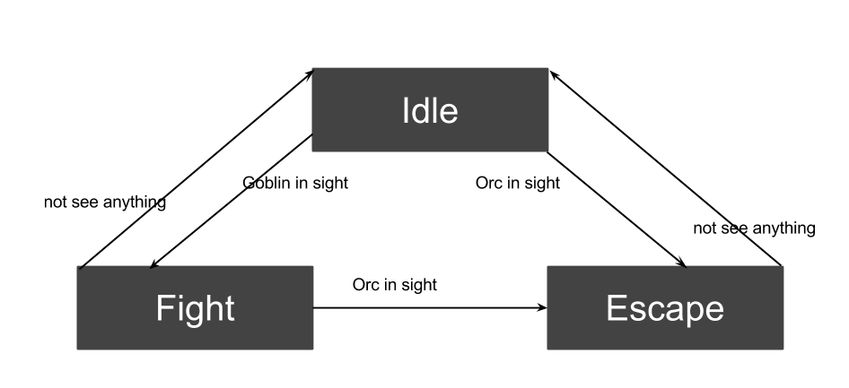
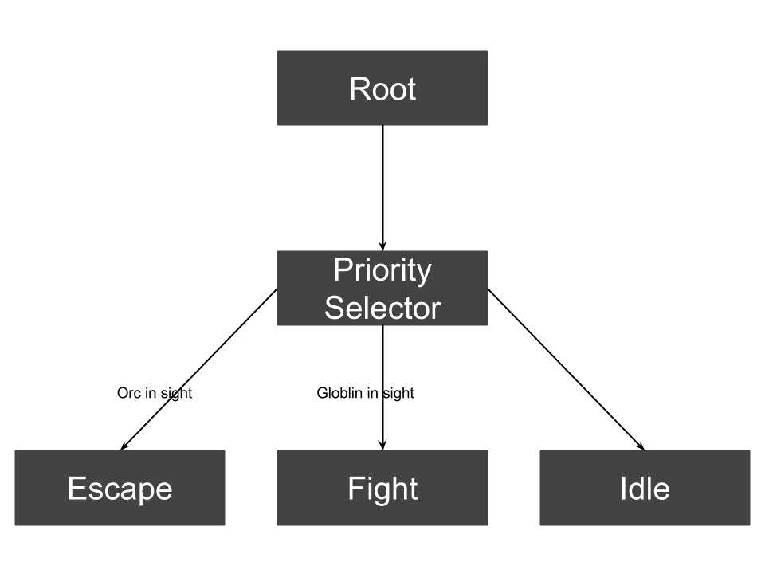
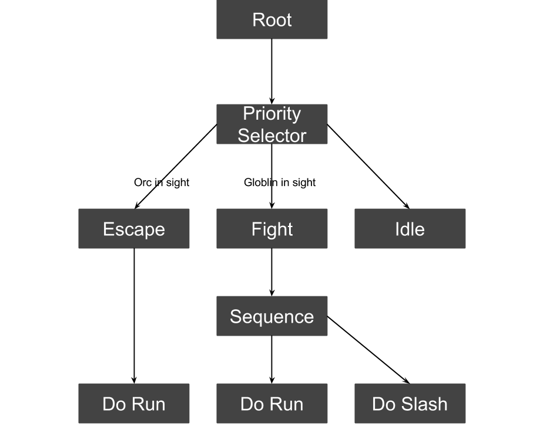
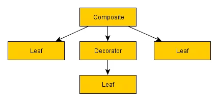
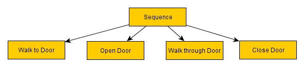
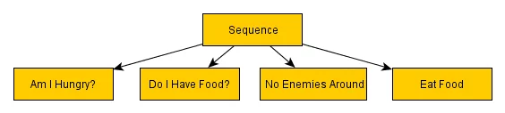
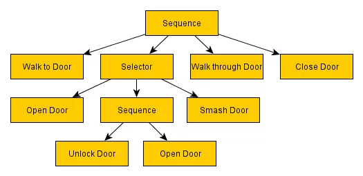

# 前言

通常，在游戏中设计/运用 AI 的时候，最简单的情况是使用 FSM（有限状态机）。FSM，顾名思义，就是包含了有限个状态以及状态间转换条件的 AI 系统。为了帮助弄明白 FSM 的概念，我们来举一个例子。

从前，有一个胆小如鼠的英雄，他：

- 看到哥布林就会跑过去打它
- 看到半兽人就会逃跑
- 看不到哥布林也看不到半兽人就休息
- 看到哥布林也看到半兽人会跑

我们可以根据上面的描述，抽象出这样一个 FSM：

其实，有限状态机很符合我们的认知，但是它有一个致命的缺点————随着状态和转换条件的增多而急速的变得错综复杂。增加一个状态，至少需要增加两条转换线（进入/退出），状态迁移图会变得越来越复杂，以至于很难对它做出改动。也由于这个原因，比较多的开发者投入了行为树的怀抱。

# 定义

行为树的概念比 FSM 要复杂一些————行为树是一棵用于控制 AI 决策行为的、包含了层级节点的树结构。树的最末端——叶子，就是这些 AI 实际上去做事情的命令；连接树叶的树枝，就是各种类型的控制/逻辑节点，这些节点决定了 AI 如何从树的顶端根据不同的情况，来沿着不同的路径来到最终的叶子这一过程。

行为树可以非常地“深”，层层节点向下延伸。凭借调用实现具体功能的子行为树，开发者可以建立相互连接的行为树库来做出非常让人信服的 AI 行为。并且，行为树的开发是高度迭代的，你可以从一个很简单的行为开始，然后做一些分支来应对不同的情境或是实现不同的目标，让 AI 的诉求来驱动行为，或是允许 AI 在行为树没有覆盖到的情境下使用备用方案等等。

下面以前面的英雄为例，画出 AI 图形：

这颗行为树功能上是等价于前面的 FSM 的。其中：

- Root 是根节点，每次需要寻找行为的时候都必须从这里开始。
- Priority Selector 是一个逻辑节点，意思是从左至右遍历自己的子节点，如果子节点的准入条件符合信息，就执行该子节点。

# 优点

从简单的行为树和 FSM 的对比，我们就可以看出，行为树由于引入逻辑节点，它的转换条件更加少（线更少，更清晰），让拓展 AI 变得更加容易。

行为树还有另外一个人优点：行为的重用。

例如下图中，Escape 有一个跑的行为，Fight 也有跑的行为：

Escape 和Fight 的 Do Run 行为节点是一样的，只是 Fight 多了一个 Do Slash 行为节点而已。所以Do Run是一个可以重用的节点。在行为树中，我们能够编写好 Do Run ， Do Slash 这些基础的行为节点，和设定一些准入条件，就可以**组成千变万化的AI**了！

# 工作流

行为树由多种不同类型的节点构成，他们都拥有一个共同的核心功能，即他们会返回三种状态中的一个作为结果。这三种状态分别是：

- 成功 - Success
- 失败 - Failure
- 运行中 - Running

前两个正如其名，是用来向他们的父节点通知运行成功或失败的结果。所谓运行中，是指行为还未执行完成，例如移动到目的地的行为，刚出发或在途中，需要反复 tick 直到行为结束。

这些状态可以用来决定行为树的走向，确保 AI 可以按照我们预期的方式来以某些顺序去执行行为树里的行为。

## 节点类型

一共有三种节点类型，他们分别是：

- 组合节点（逻辑节点） - Composite
- 修饰节点（逻辑节点） - Decorator
- 叶节点 - Leaf

### 组合节点 - Composite

组合几点通常可以拥有一个或更多的子节点。这些子节点会按照一定的次序或是随机地执行，并会根据执行的结果向父节点返回“Success”、“Failure”，或是未执行完毕时“Running”这样的结果值。

下面是一些常用的组合节点介绍。

#### 次序节点 - Sequence

正如它的名字所说，次序节点会依次（通常是从左到右）访问子节点。每个子节点成功之后便会轮到下一个，知道最后。如果所有子节点返回 Success，则次序节点返回 Success；其间任何一个子节点返回 Failure，就会立即向次序节点返回 Failure 的结果。

次序节点有很多的用处，其中显而易见的是执行一连串有前后依存关系的行为，其中一个失败必然导致后续动作没有进行的意义，比如这个“进门“行为的例子：

如果角色因为某些原因未能成功走到门前，比如路被挡住了之类的，那么试图开门这些动作都没有意义了。当走向门这个动作失败的时候，次序节点就会返回 Failure，其父节点就可以根据这个结果来进行后面的事情了。

次序节点除了非常自然地用于进行一系列前后依存的动作之外，还可以用来做一些其他的事情，如条件检查。比如这个吃东西的例子：

这些子节点会检查角色是不是饿了，有没有食物，是不是在安全的地点，只有在它们都返回 Success 时，角色才会吃东西。

#### 选择节点 - Selector

选择节点就是次序节点的反面。选择节点会在任何一个子节点返回 Success 时就返回 Success，并且不再继续运行后续的子节点。相应的，当所有子节点都返回 Failure 时，选择节点才会返回 Failure。

它的主要作用在于它可以用来表示一个行为的多种方式，从最高优先级到最低，任何一个方式的成功都会让这个动作 Success。

以前面的”进门“动作为例，下面的例子为”进门“添加了可依次尝试的不同的开门方式：

#### 随机选择节点 - Random Selector

随机等概率选择子节点，或者为子节点赋予相应权重。

#### 随机次序节点 - Random Sequence

已随机顺序执行子节点。

### 修饰节点 - Decorator

修饰节点也可以拥有子节点，但不同于组合节点，它只能拥有一个子节点。取决于修饰节点的类型，它的功能要么是修改子节点的返回结果、终止子节点，或是重复执行子节点等等。

下面是常见的修饰节点介绍。

#### 逆变节点 - Inverter

反置或否定子节点的结果。

#### 成功节点 - Succeeder

不管子节点向其返回什么结果，它总是返回 Success。

#### 重复节点 - Repeater

重复节点会在子节点返回结果吼反复继续执行它。

#### 重复直至失败节点 - Repeat Until Fail

类似重复节点重复执行子节点，但会在子节点 Failure 时返回 Failure。

### 叶节点 - Leaf

叶节点是最低层的节点，它们不会拥有子节点。叶节点是最强大的节点类型，它们是真正让你的树做具体事情的基础元素，比如 Walk 行为。通过与组合节点和修饰节点的配合，再加上你自己对叶节点功能的定义，你可以实现非常复杂的、智能的行为逻辑。

另一种叶节点的类型是调用其它的行为树，并把当前行为树的数据传给对方。这些功能将允许你高度模块化你的树并把很多节点用在更多的地方。

## 数据上下文（黑板）- Blackboard

当一个行为树被调用时，一个数据上下文被创建出来。使用数据上下文，可以避免在实现行为时，因为不同行为所需参数不同所带来的麻烦（行为间参数的传递）。黑板即是一种常见的数据上下文，用来存储被节点解释和改变的变量。
