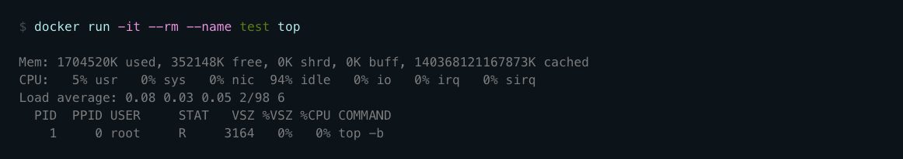
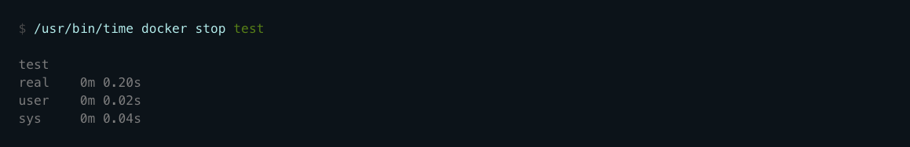
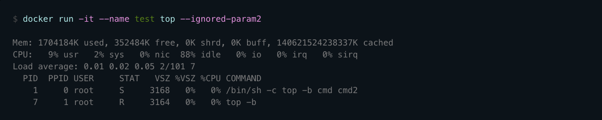
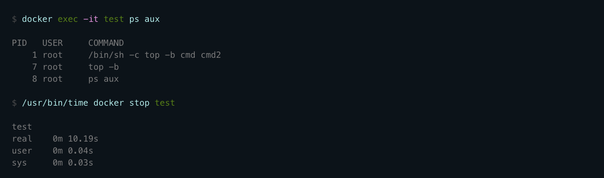

[TOC]


# 1. 获取镜像

**Docker Hub** 上有大量的高质量的镜像可以用。这里说一下怎么获取这些镜像。

从 Docker 镜像仓库获取镜像的命令是`docker pull`。其命令格式为：

```
docker pull [选项] [Docker Registry 地址:[端口号]/]仓库名[:标签]
```

说一下镜像名称的格式：

- Docker 镜像仓库地址：`<域名/ip>[:端口号]`。默认地址是 Docker Hub(`docker.io`)。
- 仓库名：`<用户名>/软件名`。对于 Docker Hub，如果不给用户名，则默认为`library`，也就是官方镜像。

比如:

```
$ docker pull ubuntu:18.04
18.04: Pulling from library/ubuntu
92dc2a97ff99: Pull complete	# 分层下载
be13a9d27eb8: Pull complete # 分层下载
c8299583700a: Pull complete # 分层下载
Digest: sha256:4bc3ae6596938cb0d9e5ac51a1152ec9dcac2a1c50829c74abd9c4361e321b26
Status: Downloaded newer image for ubuntu:18.04
docker.io/library/ubuntu:18.04
```

上面的命令中没有给出 Docker 镜像仓库地址，因此将会从 Docker Hub （`docker.io`）获取镜像。而镜像名称是 `ubuntu:18.04`，因此将会获取官方镜像 `library/ubuntu` 仓库中标签为 `18.04` 的镜像。`docker pull` 命令的输出结果最后一行给出了镜像的完整名称，即： `docker.io/library/ubuntu:18.04`。

从下载过程中可以看到我们之前提及的分层存储的概念，镜像是由多层存储所构成。下载也是一层层的去下载，并非单一文件。下载过程中给出了每一层的 ID 的前 12 位。并且下载结束后，给出该镜像完整的 `sha256` 的摘要，以确保下载一致性。

## 1.1 运行

有了镜像后，我们就能够以这个镜像为基础启动并运行一个容器。以上面的 `ubuntu:18.04` 为例，如果我们打算启动里面的 `bash` 并且进行交互式操作的话，可以执行下面的命令。

```
$ docker run -it --rm ubuntu:18.04 bash
root@27b733d723ca:/# cat /etc/os-release
NAME="Ubuntu"
VERSION="18.04.5 LTS (Bionic Beaver)"
ID=ubuntu
ID_LIKE=debian
PRETTY_NAME="Ubuntu 18.04.5 LTS"
VERSION_ID="18.04"
HOME_URL="https://www.ubuntu.com/"
SUPPORT_URL="https://help.ubuntu.com/"
BUG_REPORT_URL="https://bugs.launchpad.net/ubuntu/"
PRIVACY_POLICY_URL="https://www.ubuntu.com/legal/terms-and-policies/privacy-policy"
VERSION_CODENAME=bionic
UBUNTU_CODENAME=bionic
```

参数说明:

- `-it`：实际上是两个参数，`-i`：交互式模式，`-t`：启动伪终端。
- `--rm`：容器退出后自动删除容器。默认情况下，为了排障需求，退出的容器不会立即删除，除非手动执行`docker rm`。
- `bash`：镜像命后跟需要执行的命令。

# 2. 列出镜像

要想列出已经下载下来的镜像，可以使用 `docker image ls` 或`docker images`命令。

```
$ docker image ls
REPOSITORY                                                    TAG       IMAGE ID       CREATED        SIZE
ubuntu                                                        18.04     7d0d8fa37224   6 days ago     63.1MB
kicbase/stable                                                v0.0.22   bcd131522525   7 weeks ago    1.09GB
registry.cn-hangzhou.aliyuncs.com/google_containers/kicbase   v0.0.22   bcd131522525   7 weeks ago    1.09GB
hello-world                                                   latest    d1165f221234   3 months ago   13.3kB
```

列表包含了 `仓库名`、`标签`、`镜像 ID`、`创建时间` 以及 `所占用的空间`。

## 2.1 镜像体积

镜像在本地的大小与在 **Docker Hub** 上的不同，因为 Docker Hub 中显示的体积是压缩后的。在镜像下载和上传过程中镜像是保持着压缩状态的，因此 Docker Hub 所显示的大小是网络传输中更关心的流量大小。

`docker image ls`显示的是镜像下载到本地后，展开的大小。准确的说，是镜像在本地展开后各层所占空间的总和。


另外，`docker image ls`列出的镜像体积总和并非是所有镜像实际硬盘消耗。由于 Docker 镜像是分层存储结构，并且可以继承、复用，因此不同镜像可能会使用相同的基础镜像，从而拥有共同的层。由于 Docker 使用 **Union FS**，相同层只需要存储一份即可，因此实际镜像硬盘占用空间很可能要比这个列表镜像大小的总和小得多。

可以通过`docker system df`命令查看镜像、容器、数据卷所占用的空间。

```
$ docker system df
TYPE            TOTAL     ACTIVE    SIZE      RECLAIMABLE
Images          3         2         1.153GB   63.11MB (5%)
Containers      2         1         3.512MB   0B (0%)
Local Volumes   1         1         2.557GB   0B (0%)
Build Cache     0         0         0B        0B
```

## 2.2 虚悬镜像

有时，在镜像列表中，可能会出现一种特殊的镜像，这种镜像即没有仓库名，也没有标签，均为`<none>`:

```
<none>               <none>              00285df0df87        5 days ago          342 MB
```

这种镜像原本是有仓库名和标签的，例如`mongo:3.2`，但随着官方的镜像维护，发布了新版本后，重新`docker pull mongo:3.2`时，`mongo:3.2`这个镜像名被转移到了新下载的镜像身上，而旧的镜像上的这个名称则被取消，从而变成`<none>`。除了 `docker pull` 可能导致这种情况，`docker build` 也同样可以导致这种现象。由于新旧镜像同名，旧镜像名称被取消，从而出现仓库名、标签均为 `<none>` 的镜像。这类无标签，无仓库名的镜像也被称为 **虚悬镜像（dangling image）**，可以用下面的命令专门显示这类镜像：

```
$ docker image ls -f dangling=true
REPOSITORY          TAG                 IMAGE ID            CREATED             SIZE
<none>              <none>              00285df0df87        5 days ago          342 MB
```

一般来说，虚悬镜像已经失去了存在的价值，是可以随意删除的，可以用下面的命令删除。

```
$ docker image prune
```

## 2.3 中间层镜像

为了加速镜像构建、重复利用资源，Docker 会利用 **中间层镜像**。所以在使用一段时间后，可能会看到一些依赖的中间层镜像。默认的 `docker image ls` 列表中只会显示顶层镜像，如果希望显示包括中间层镜像在内的所有镜像的话，需要加 `-a` 参数。

```
$ docker image ls -a
```

这样会看到很多无标签的镜像，与之前的虚悬镜像不同，这些无标签的镜像很多都是中间层镜像，是其它镜像所依赖的镜像。这些无标签镜像不应该删除，否则会导致上层镜像因为依赖丢失而出错。实际上，这些镜像也没必要删除，因为之前说过，相同的层只会存一遍，而这些镜像是别的镜像的依赖，因此并不会因为它们被列出来而多存了一份，无论如何你也会需要它们。只要删除那些依赖它们的镜像后，这些依赖的中间层镜像也会被连带删除。

没必要单独去管理中间层镜像。

## 2.4 流出部分镜像

不加任何参数的情况下，`docker image ls` 会列出所有顶层镜像，但是有时候我们只希望列出部分镜像。`docker image ls` 有好几个参数可以帮助做到这个事情。

根据仓库名列出镜像:

```
$ docker image ls ubuntu
```

列出特定的某个镜像，也就是说指定仓库名和标签

```
$ docker image ls ubuntu:18.04
```

除此以外，`docker image ls` 还支持强大的过滤器参数 `--filter`，或者简写 `-f`：

```
$ docker image ls -f condtion=value
conditions:
	dangling	是否虚悬镜像
	since			在某镜像创建之后
	before		在某镜像创建之前
	label			镜像构建时设置的标签，例如 label=com.example.version=0.1
```

## 2.5 以特定格式显示

默认情况下，`docker image ls` 会输出一个完整的表格，但是我们并非所有时候都会需要这些内容。比如，刚才删除虚悬镜像的时候，我们需要利用 `docker image ls` 把所有的虚悬镜像的 ID 列出来，然后才可以交给 `docker image rm` 命令作为参数来删除指定的这些镜像，这个时候就用到了 `-q` 参数。

```
$ docker image ls -q
7d0d8fa37224
bcd131522525
bcd131522525
d1165f221234
```

`--filter` 配合 `-q` 产生出指定范围的 ID 列表，然后送给另一个 `docker` 命令作为参数，从而针对这组实体成批的进行某种操作的做法在 Docker 命令行使用过程中非常常见，不仅仅是镜像，将来我们会在各个命令中看到这类搭配以完成很强大的功能。

比如，下面的命令会直接列出镜像结果，并且只包含镜像ID和仓库名：

```
$ docker image ls --format "{{.ID}}: {{.Repository}}"
5f515359c7f8: redis
05a60462f8ba: nginx
fe9198c04d62: mongo
00285df0df87: <none>
329ed837d508: ubuntu
329ed837d508: ubuntu
```

或者打算以表格等距显示，并且有标题行，和默认一样，不过自己定义列：

```
$ docker image ls --format "table {{.ID}}\t{{.Repository}}\t{{.Tag}}"
IMAGE ID            REPOSITORY          TAG
5f515359c7f8        redis               latest
05a60462f8ba        nginx               latest
fe9198c04d62        mongo               3.2
00285df0df87        <none>              <none>
329ed837d508        ubuntu              18.04
329ed837d508        ubuntu              bionic
```

# 3. 删除本地镜像

使用`docker image rm`命令删除本地镜像：

```
$ docker image rm [OPTIONS] IMAGE [IMAGE...]
```

## 3.1 用 ID、镜像名、摘要删除镜像

其中，`<IMAGE>` 可以是 `镜像短 ID`、`镜像长 ID`、`镜像名` 或者 `镜像摘要`。

比如我们有这么一些镜像：

```
$ docker image ls
REPOSITORY                  TAG                 IMAGE ID            CREATED             SIZE
centos                      latest              0584b3d2cf6d        3 weeks ago         196.5 MB
redis                       alpine              501ad78535f0        3 weeks ago         21.03 MB
docker                      latest              cf693ec9b5c7        3 weeks ago         105.1 MB
nginx                       latest              e43d811ce2f4        5 weeks ago         181.5 MB
```

我们可以用镜像的完整 ID，也称为 `长 ID`，来删除镜像。使用脚本的时候可能会用长 ID，但是人工输入就太累了，所以更多的时候是用 `短 ID` 来删除镜像。`docker image ls` 默认列出的就已经是短 ID 了，一般取前3个字符以上，只要足够区分于别的镜像就可以了。

比如这里，如果我们要删除 `redis:alpine` 镜像，可以执行：

```
$ docker image rm 501
Untagged: redis:alpine
Untagged: redis@sha256:f1ed3708f538b537eb9c2a7dd50dc90a706f7debd7e1196c9264edeea521a86d
Deleted: sha256:501ad78535f015d88872e13fa87a828425117e3d28075d0c117932b05bf189b7
Deleted: sha256:96167737e29ca8e9d74982ef2a0dda76ed7b430da55e321c071f0dbff8c2899b
Deleted: sha256:32770d1dcf835f192cafd6b9263b7b597a1778a403a109e2cc2ee866f74adf23
Deleted: sha256:127227698ad74a5846ff5153475e03439d96d4b1c7f2a449c7a826ef74a2d2fa
Deleted: sha256:1333ecc582459bac54e1437335c0816bc17634e131ea0cc48daa27d32c75eab3
Deleted: sha256:4fc455b921edf9c4aea207c51ab39b10b06540c8b4825ba57b3feed1668fa7c7
```

我们也可以用`镜像名`，也就是 `<仓库名>:<标签>`，来删除镜像。

```
$ docker image rm centos
Untagged: centos:latest
Untagged: centos@sha256:b2f9d1c0ff5f87a4743104d099a3d561002ac500db1b9bfa02a783a46e0d366c
Deleted: sha256:0584b3d2cf6d235ee310cf14b54667d889887b838d3f3d3033acd70fc3c48b8a
Deleted: sha256:97ca462ad9eeae25941546209454496e1d66749d53dfa2ee32bf1faabd239d38
```

当然，更精确的是使用 `镜像摘要` 删除镜像。

```
$ docker image ls --digests
REPOSITORY                  TAG                 DIGEST                                                                    IMAGE ID            CREATED             SIZE
node                        slim                sha256:b4f0e0bdeb578043c1ea6862f0d40cc4afe32a4a582f3be235a3b164422be228   6e0c4c8e3913        3 weeks ago         214 MB

$ docker image rm node@sha256:b4f0e0bdeb578043c1ea6862f0d40cc4afe32a4a582f3be235a3b164422be228
Untagged: node@sha256:b4f0e0bdeb578043c1ea6862f0d40cc4afe32a4a582f3be235a3b164422be228
```

## 3.2 Untagged 和 Deleted

观察前面几个命令的运行输出信息的话，能够注意到删除行为分为两类，一类是 **Untagged**，另一类是 **Deleted**。前面介绍过，镜像的唯一标识是其 ID 和 摘要，而一个镜像可以有多个标签。

因此当我们使用上面命令删除镜像的时候，实际上是在要求删除某个标签的镜像。所以首先需要做的是将满足我们要求的所有镜像标签都取消，这就是我们看到的 `Untagged` 的信息。因为一个镜像可以对应多个标签，因此当我们删除了所指定的标签后，可能还有别的标签指向了这个镜像，如果是这种情况，那么 `Delete` 行为就不会发生。所以并非所有的 `docker image rm` 都会产生删除镜像的行为，有可能仅仅是取消了某个标签而已。

当该镜像所有的标签都被取消了，该镜像很可能会失去了存在的意义，因此会触发删除行为。镜像是多层存储结构，因此在删除的时候也是从上层向基础层方向依次进行判断删除。镜像的多层结构让镜像复用变得非常容易，因此很有可能某个其它镜像正依赖于当前镜像的某一层。这种情况，依旧不会触发删除该层的行为。直到没有任何层依赖当前层时，才会真实的删除当前层。这就是为什么，有时候会奇怪，为什么明明没有别的标签指向这个镜像，但是它还是存在的原因，也是为什么有时候会发现所删除的层数和自己 `docker pull` 看到的层数不一样的原因。

除了镜像依赖以外，还需要注意的是容器对镜像的依赖。如果有用这个镜像启动的容器存在（即使容器没有运行），那么同样不可以删除这个镜像。之前讲过，容器是以镜像为基础，再加一层容器存储层，组成这样的多层存储结构去运行的。因此该镜像如果被这个容器所依赖的，那么删除必然会导致故障。如果这些容器是不需要的，应该先将它们删除，然后再来删除镜像。

## 3.3 用 docker image ls 命令来配合

像其它可以承接多个实体的命令一样，可以使用`docker image ls -q`来配合使用`docker image rm`，这样可以成批的删除希望删除的镜像。

比如，我们需要删除所有仓库名为`redis`的镜像：

```
$ docker image rm $(docker image ls -q redis)
```

或者删除所有在 `mongo:3.2` 之前的镜像：

```
$ docker image rm $(docker image ls -q -f before=mongo:3.2)
```

# 4. 利用 commit 理解镜像构成

注意： `docker commit` 命令除了学习之外，还有一些特殊的应用场合，比如被入侵后保存现场等。但是，不要使用 `docker commit` 定制镜像，定制镜像应该使用 `Dockerfile` 来完成。

镜像是容器的基础，每次执行 `docker run` 的时候都会指定哪个镜像作为容器运行的基础。在之前的例子中，我们所使用的都是来自于 Docker Hub 的镜像。直接使用这些镜像是可以满足一定的需求，而当这些镜像无法直接满足需求时，我们就需要定制这些镜像。

回顾一下之前我们学到的知识，镜像是多层存储，每一层是在前一层的基础上进行的修改；而容器同样也是多层存储，是在以镜像为基础层，在其基础上加一层作为容器运行时的存储层。

现在让我们以定制一个 Web 服务器为例子，来讲解镜像是如何构建的。

```
$ docker run --name webserver -d -p 80:80 nginx
```

这条命令会用 `nginx` 镜像启动一个容器，命名为 `webserver`，并且映射了 80 端口，这样我们可以用浏览器去访问这个 `nginx` 服务器。

如果是在本机运行的 Docker，那么可以直接访问：`http://localhost` ，如果是在虚拟机、云服务器上安装的 Docker，则需要将 `localhost` 换为虚拟机地址或者实际云服务器地址。

直接用浏览器访问的话，我们会看到默认的 Nginx 欢迎页面。


现在，假设我们非常不喜欢这个欢迎页面，我们希望改成欢迎 Docker 的文字，我们可以使用 `docker exec` 命令进入容器，修改其内容。

```
$ docker exec -it webserver bash
root@3729b97e8226:/# echo '<h1>Hello, Docker!</h1>' > /usr/share/nginx/html/index.html
root@3729b97e8226:/# exit
exit
```

我们以交互式终端方式进入 `webserver` 容器，并执行了 `bash` 命令，也就是获得一个可操作的 Shell。

然后，我们用 `<h1>Hello, Docker!</h1>` 覆盖了 `/usr/share/nginx/html/index.html` 的内容。

现在我们再刷新浏览器的话，会发现内容被改变了。


我们修改了容器的文件，也就是改动了容器的存储层。我们可以通过 `docker diff` 命令看到具体的改动。

现在我们定制好了变化，我们希望能将其保存下来形成镜像。

要知道，当我们运行一个容器的时候（如果不使用卷的话），我们做的任何文件修改都会被记录于容器存储层里。而 Docker 提供了一个 `docker commit` 命令，可以将容器的存储层保存下来成为镜像。换句话说，就是在原有镜像的基础上，再叠加上容器的存储层，并构成新的镜像。以后我们运行这个新镜像的时候，就会拥有原有容器最后的文件变化。

`docker commit` 的语法格式为：

```
docker commit [选项] <容器ID或容器名> [<仓库名>[:<标签>]]
```

我们可以用下面的命令将容器保存为镜像：

```
$ docker commit \
    --author "godyy <godyy1988@gmail.com>" \
    --message "修改了默认网页" \
    webserver \
    nginx:v2
sha256:07e33465974800ce65751acc279adc6ed2dc5ed4e0838f8b86f0c87aa1795214
```

其中 `--author` 是指定修改的作者，而 `--message` 则是记录本次修改的内容。这点和 `git` 版本控制相似，不过这里这些信息可以省略留空。

我们可以在 `docker image ls` 中看到这个新定制的镜像：

```
$ docker image ls nginx
REPOSITORY          TAG                 IMAGE ID            CREATED             SIZE
nginx               v2                  07e334659748        9 seconds ago       181.5 MB
nginx               1.11                05a60462f8ba        12 days ago         181.5 MB
nginx               latest              e43d811ce2f4        4 weeks ago         181.5 MB
```

可以用`docker history`命令查看镜像内的历史记录，如果比较`nginx:latest`的历史记录，我们会发现新增了我们刚刚提交的这一层。

```
$ docker history nginx:v2
IMAGE               CREATED             CREATED BY                                      SIZE                COMMENT
07e334659748        54 seconds ago      nginx -g daemon off;                            95 B                修改了默认网页
e43d811ce2f4        4 weeks ago         /bin/sh -c #(nop)  CMD ["nginx" "-g" "daemon    0 B
<missing>           4 weeks ago         /bin/sh -c #(nop)  EXPOSE 443/tcp 80/tcp        0 B
<missing>           4 weeks ago         /bin/sh -c ln -sf /dev/stdout /var/log/nginx/   22 B
<missing>           4 weeks ago         /bin/sh -c apt-key adv --keyserver hkp://pgp.   58.46 MB
<missing>           4 weeks ago         /bin/sh -c #(nop)  ENV NGINX_VERSION=1.11.5-1   0 B
<missing>           4 weeks ago         /bin/sh -c #(nop)  MAINTAINER NGINX Docker Ma   0 B
<missing>           4 weeks ago         /bin/sh -c #(nop)  CMD ["/bin/bash"]            0 B
<missing>           4 weeks ago         /bin/sh -c #(nop) ADD file:23aa4f893e3288698c   123 MB
```

运行新的镜像：

```
docker run --name web2 -d -p 81:80 nginx:v2
```

## 4.1 慎用 docker commit

使用 `docker commit` 命令虽然可以比较直观的帮助理解镜像分层存储的概念，但是实际环境中并不会这样使用。

首先，如果仔细观察之前的 `docker diff webserver` 的结果，你会发现除了真正想要修改的 `/usr/share/nginx/html/index.html` 文件外，由于命令的执行，还有很多文件被改动或添加了。这还仅仅是最简单的操作，如果是安装软件包、编译构建，那会有大量的无关内容被添加进来，将会导致镜像极为臃肿。

此外，使用 `docker commit` 意味着所有对镜像的操作都是黑箱操作，生成的镜像也被称为 **黑箱镜像**，换句话说，就是除了制作镜像的人知道执行过什么命令、怎么生成的镜像，别人根本无从得知。而且，即使是这个制作镜像的人，过一段时间后也无法记清具体的操作。这种黑箱镜像的维护工作是非常痛苦的。

而且，回顾之前提及的镜像所使用的分层存储的概念，除当前层外，之前的每一层都是不会发生改变的，换句话说，任何修改的结果仅仅是在当前层进行标记、添加、修改，而不会改动上一层。如果使用 `docker commit` 制作镜像，以及后期修改的话，每一次修改都会让镜像更加臃肿一次，所删除的上一层的东西并不会丢失，会一直如影随形的跟着这个镜像，即使根本无法访问到。这会让镜像更加臃肿。

# 5. 使用 Dockerfile 定制镜像

从`docker commit`的学习中，我们可以了解到，镜像的定制实际上就是指定制每一层所添加的配置、文件。如果我们可以把每一层修改、安装、构建、操作的命令都写入一个脚本，用这个脚本来构建、定制镜像，那么之前提及的无法重复的问题、镜像构建透明性的问题、体积的问题就都会解决。这个脚本就是 **Dockerfile**。

Dockerfile 是一个文本文件，其内包含了一条条的指令（instruction），每一条指令构建一个层，因此每一条指令的内容，就是描述该层应当如何构建。

还以之前定制 `nginx` 镜像为例，这次我们使用 Dockerfile 来定制。

在一个空白目录中，建立一个文本文件，并命名为 `Dockerfile`：

```
$ mkdir mynginx
$ cd mynginx
$ touch Dockerfile
```

其内容为：

```
FROM nginx
RUN echo '<h1>Hello, Docker!</h1>' > /usr/share/nginx/html/index.html
```

这个 Dockerfile 很简单，一共就两行。涉及到了两条指令，`FROM` 和 `RUN`。

## 5.1 FROM 指定基础镜像

所谓定制镜像，那一定是以一个镜像为基础，在其上进行定制。就像我们之前运行了一个 `nginx` 镜像的容器，再进行修改一样，基础镜像是必须指定的。而 `FROM` 就是指定 **基础镜像**，因此一个 `Dockerfile` 中 `FROM` 是必备的指令，并且必须是第一条指令。

在 [Docker Hub](https://hub.docker.com/search?q=&type=image&image_filter=official) 上有非常多的高质量的官方镜像，有可以直接拿来使用的服务类的镜像，如 [`nginx`](https://hub.docker.com/_/nginx/)、[`redis`](https://hub.docker.com/_/redis/)、[`mongo`](https://hub.docker.com/_/mongo/)、[`mysql`](https://hub.docker.com/_/mysql/)、[`httpd`](https://hub.docker.com/_/httpd/)、[`php`](https://hub.docker.com/_/php/)、[`tomcat`](https://hub.docker.com/_/tomcat/) 等；也有一些方便开发、构建、运行各种语言应用的镜像，如 [`node`](https://hub.docker.com/_/node)、[`openjdk`](https://hub.docker.com/_/openjdk/)、[`python`](https://hub.docker.com/_/python/)、[`ruby`](https://hub.docker.com/_/ruby/)、[`golang`](https://hub.docker.com/_/golang/) 等。可以在其中寻找一个最符合我们最终目标的镜像为基础镜像进行定制。

如果没有找到对应服务的镜像，官方镜像中还提供了一些更为基础的操作系统镜像，如 [`ubuntu`](https://hub.docker.com/_/ubuntu/)、[`debian`](https://hub.docker.com/_/debian/)、[`centos`](https://hub.docker.com/_/centos/)、[`fedora`](https://hub.docker.com/_/fedora/)、[`alpine`](https://hub.docker.com/_/alpine/) 等，这些操作系统的软件库为我们提供了更广阔的扩展空间。

除了选择现有镜像为基础镜像外，Docker 还存在一个特殊的镜像，名为 `scratch`。这个镜像是虚拟的概念，并不实际存在，它表示一个空白的镜像。

```
FROM scratch
...
```

如果你以 `scratch` 为基础镜像的话，意味着你不以任何镜像为基础，接下来所写的指令将作为镜像第一层开始存在。(FROM 其它基础镜像，该基础镜像为第一层)

不以任何系统为基础，直接将可执行文件复制进镜像的做法并不罕见，对于 Linux 下静态编译的程序来说，并不需要有操作系统提供运行时支持，所需的一切库都已经在可执行文件里了，因此直接 `FROM scratch` 会让镜像体积更加小巧。使用 [Go 语言](https://golang.google.cn/) 开发的应用很多会使用这种方式来制作镜像，这也是为什么有人认为 Go 是特别适合容器微服务架构的语言的原因之一。

## 5.2 RUN 执行命令

`RUN` 指令是用来执行命令行命令的。由于命令行的强大能力，`RUN` 指令在定制镜像时是最常用的指令之一。其格式有两种：

- *shell* 格式：`RUN <命令>`，就像直接在命令行中输入的命令一样。刚才写的 Dockerfile 中的 `RUN` 指令就是这种格式。

  ```
  RUN echo '<h1>Hello, Docker!</h1>' > /usr/share/nginx/html/index.html
  ```

- *exec* 格式：`RUN ["可执行文件", "参数1", "参数2"]`，这更像是函数调用中的格式。

既然 `RUN` 就像 Shell 脚本一样可以执行命令，那么我们是否就可以像 Shell 脚本一样把每个命令对应一个 RUN 呢？比如这样：

```
FROM debian:stretch

RUN apt-get update
RUN apt-get install -y gcc libc6-dev make wget
RUN wget -O redis.tar.gz "http://download.redis.io/releases/redis-5.0.3.tar.gz"
RUN mkdir -p /usr/src/redis
RUN tar -xzf redis.tar.gz -C /usr/src/redis --strip-components=1
RUN make -C /usr/src/redis
RUN make -C /usr/src/redis install
```

前面说过，Dockerfile 中每一个指令都会建立一层，`RUN`也不例外。每一个 `RUN` 的行为，就和我们手工建立镜像的过程一样：新建立一层（类似容器存储层），在其上执行这些命令，执行结束后，`commit` 这一层的修改，构成新的镜像。

而上面的这种写法，创建了 7 层镜像。这是完全没有意义的，而且很多运行时不需要的东西，都被装进了镜像里，比如编译环境、更新的软件包等等。结果就是产生非常臃肿、非常多层的镜像，不仅仅增加了构建部署的时间，也很容易出错。 这是很多初学 Docker 的人常犯的一个错误。

> *Union FS 是有最大层数限制的，比如 AUFS，曾经是最大不得超过 42 层，现在是不得超过 127 层。*

上面的 `Dockerfile`的正确写法应该是这样：

```
FROM debian:stretch

RUN set -x; buildDeps='gcc libc6-dev make wget' \
    && apt-get update \
    && apt-get install -y $buildDeps \
    && wget -O redis.tar.gz "http://download.redis.io/releases/redis-5.0.3.tar.gz" \
    && mkdir -p /usr/src/redis \
    && tar -xzf redis.tar.gz -C /usr/src/redis --strip-components=1 \
    && make -C /usr/src/redis \
    && make -C /usr/src/redis install \
    && rm -rf /var/lib/apt/lists/* \
    && rm redis.tar.gz \
    && rm -r /usr/src/redis \
    && apt-get purge -y --auto-remove $buildDeps
```

首先，之前所有的命令只有一个目的，就是编译、安装 redis 可执行文件。因此没有必要建立很多层，这只是一层的事情。因此，这里没有使用很多个 `RUN` 一一对应不同的命令，而是仅仅使用一个 `RUN` 指令，并使用 `&&` 将各个所需命令串联起来。将之前的 7 层，简化为了 1 层。在撰写 Dockerfile 的时候，要经常提醒自己，这并不是在写 Shell 脚本，而是在定义每一层该如何构建。

并且，这里为了格式化还进行了换行。Dockerfile 支持 Shell 类的行尾添加 `\` 的命令换行方式，以及行首 `#` 进行注释的格式。良好的格式，比如换行、缩进、注释等，会让维护、排障更为容易，这是一个比较好的习惯。

此外，还可以看到这一组命令的最后添加了清理工作的命令，删除了为了编译构建所需要的软件，清理了所有下载、展开的文件，并且还清理了 `apt` 缓存文件。这是很重要的一步，我们之前说过，镜像是多层存储，每一层的东西并不会在下一层被删除，会一直跟随着镜像。因此镜像构建时，一定要确保每一层只添加真正需要添加的东西，任何无关的东西都应该清理掉。

很多人初学 Docker 制作出了很臃肿的镜像的原因之一，就是忘记了每一层构建的最后一定要清理掉无关文件。

## 5.3 构建镜像

好了，让我们再回到之前定制的 nginx 镜像的 Dockerfile 来。现在我们明白了这个 Dockerfile 的内容，那么让我们来构建这个镜像吧。

在 `Dockerfile` 文件所在目录执行：

```
$ docker build -t nginx:v3 .
Sending build context to Docker daemon 2.048 kB
Step 1 : FROM nginx
 ---> e43d811ce2f4
Step 2 : RUN echo '<h1>Hello, Docker!</h1>' > /usr/share/nginx/html/index.html
 ---> Running in 9cdc27646c7b
 ---> 44aa4490ce2c
Removing intermediate container 9cdc27646c7b
Successfully built 44aa4490ce2c
```

从命令的输出结果中，我们可以清晰的看到镜像的构建过程。在 `Step 2` 中，如同我们之前所说的那样，`RUN` 指令启动了一个容器 `9cdc27646c7b`，执行了所要求的命令，并最后提交了这一层 `44aa4490ce2c`，随后删除了所用到的这个容器 `9cdc27646c7b`。

这里我们使用了 `docker build` 命令进行镜像构建。其格式为：

```
docker build [选项] <上下文路径/URL/->
```

在这里我们指定了最终镜像的名称 `-t nginx:v3`，构建成功后，我们可以像之前运行 `nginx:v2` 那样来运行这个镜像，其结果会和 `nginx:v2` 一样。

## 5.4 镜像构建上下文

前面所讲的`docker build`命令最后又一个`.`参数。`.`表示当前目录，而 Dockerfile 就在当前目录，因此不少初学者以为这个路径是在指定 Dockerfile 的所在路径，这么理解其实是不准确的。对应上面的命令格式，这是在指定上下文路径。那么，什么是上下文呢？

首先，我们要理解`docker build`的工作原理。Docker 在运行时分为 **Docker 引擎**（也就是服务端守护进程）和 **客户端工具**。Docker 的引擎提供了一组 REST API，被称为 [Docker Remote API](https://docs.docker.com/develop/sdk/)，而如 `docker` 命令这样的客户端工具，则是通过这组 API 与 Docker 引擎交互，从而完成各种功能。因此，虽然表面上我们好像是在本机执行各种 `docker` 功能，但实际上，一切都是使用的远程调用形式在服务端（Docker 引擎）完成。也因为这种 C/S 设计，让我们操作远程服务器的 Docker 引擎变得轻而易举。

当我们进行镜像构建的时候，并非所有定制都会通过 `RUN` 指令完成，经常会需要将一些本地文件复制进镜像，比如通过 `COPY` 指令、`ADD` 指令等。而 `docker build` 命令构建镜像，其实并非在本地构建，而是在服务端，也就是 Docker 引擎中构建的。那么在这种客户端/服务端的架构中，如何才能让服务端获得本地文件呢？

这就引入了上下文的概念。当构建的时候，用户会指定构建镜像上下文的路径，`docker build` 命令得知这个路径后，会将路径下的所有内容打包，然后上传给 Docker 引擎。这样 Docker 引擎收到这个上下文包后，展开就会获得构建镜像所需的一切文件。

如果在 `Dockerfile` 中这么写：

```
COPY ./package.json /app/
```

这并不是要复制执行 `docker build` 命令所在的目录下的 `package.json`，也不是复制 `Dockerfile` 所在目录下的 `package.json`，而是复制 **上下文（context）** 目录下的 `package.json`。因此，`COPY` 这类指令中的源文件的路径都是*相对路径*。

如果观察 `docker build` 输出，我们其实已经看到了这个发送上下文的过程：

```
$ docker build -t nginx:v3 .
Sending build context to Docker daemon 2.048 kB
...
```

**理解构建上下文对于镜像构建是很重要的，避免犯一些不应该的错误。**

一般来说，应该会将 `Dockerfile` 置于一个空目录下，或者项目根目录下。如果该目录下没有所需文件，那么应该把所需文件复制一份过来。如果目录下有些东西确实不希望构建时传给 Docker 引擎，那么可以用 `.gitignore` 一样的语法写一个 `.dockerignore`，该文件是用于剔除不需要作为上下文传递给 Docker 引擎的。

那么为什么会有人误以为 `.` 是指定 `Dockerfile` 所在目录呢？这是因为在默认情况下，如果不额外指定 `Dockerfile` 的话，会将上下文目录下的名为 `Dockerfile` 的文件作为 Dockerfile。

这只是默认行为，实际上 `Dockerfile` 的文件名并不要求必须为 `Dockerfile`，而且并不要求必须位于上下文目录中，比如可以用 `-f ../Dockerfile.php` 参数指定某个文件作为 `Dockerfile`。

当然，一般大家习惯性的会使用默认的文件名 `Dockerfile`，以及会将其置于镜像构建上下文目录中。

## 5.5 其它 docker build 的用法

### 直接用`Git repo`进行构建

`docker build`还支持从 URL 构建，比如可直接从 Git repo 中构建：

```
# $env:DOCKER_BUILDKIT=0
# export DOCKER_BUILDKIT=0

$ docker build -t hello-world https://github.com/docker-library/hello-world.git#master:amd64/hello-world
```

这行命令指定了构建所需的 Git repo，并且指定分支为 `master`，构建目录为 `/amd64/hello-world/`，然后 Docker 就会自己去 `git clone` 这个项目、切换到指定分支、并进入到指定目录后开始构建。

### 用给定的 tar 压缩包构建

```
$ docker build http://server/context.tar.gz
```

如果所给出的 URL 不是个 Git repo，而是个 `tar` 压缩包，那么 Docker 引擎会下载这个包，并自动解压缩，以其作为上下文，开始构建。

### 从标准输入读取 Dockerfile 进行构建

```
docker build - < Dockerfile
```

或

```
cat Dockerfile | docker build -
```

如果标准输入传入的是文本文件，则将其视为 `Dockerfile`，并开始构建。这种形式由于直接从标准输入中读取 Dockerfile 的内容，它没有上下文，因此不可以像其他方法那样可以将本地文件 `COPY` 进镜像之类的事情。

### 从标准输入中读取上下文压缩包进行构建

```
$ docker build - < context.tar.gz
```

如果发现标准输入的文件格式是 `gzip`、`bzip2` 以及 `xz` 的话，将会使其为上下文压缩包，直接将其展开，将里面视为上下文，并开始构建。

## 5.6 BuildKit

从 18.09 版本开始，Docker 支持 [moby/buildkit](https://github.com/moby/buildkit) 项目提供的一个新的后端来执行构建。与旧的实现相比，BuildKit后端提供了许多优点。例如，BuildKit可以:

- 检测并跳过未使用的构建阶段
- 并行构建独立的构建阶段
- 在构建之间只增量地传输构建上下文中已更改的文件
- 检测并跳过在构建上下文中传输未使用的文件
- 使用带有许多新特性的外部 Dockerfile 实现
- 避免对其余API(中间镜像和容器)产生副作用
- 将构建缓存按优先级排序，以便进行自动修剪

要使用 BuildKit 后端，需要在调用`docker build`之前在 CLI 中设置一个环境变量`DOCKER_BUILDKIT=1`。

要了解基于 BuildKit 的构建可用的实验性 Dockerfile 语法，请参阅[BuildKit存储库中的文档](https://github.com/moby/buildkit/blob/master/frontend/dockerfile/docs/experimental.md)。

## 5.7 解析器指令（Parser directives）

解析器指令是可选的，它会影响 Dockerfile 中后续行的处理方式。解析器指令被写成一种特殊类型的注释，形式为`# directive=value`。

具有以下特点：

- 解析器指令不会向构建中添加层，也不会显示为构建步骤
- 单个解析器指令只能使用一次
- 解析器指令必须位于 Dockerfile 顶部。一旦注释、空行或构建指令被处理，Docker 就不再查找解析器指令，将以注释对待之
- 解析器指令不区分大小写。惯例，小写，并且在解析器指令后包含空行
- 按惯例，在解析器指令后要包含空行。所以解析器指令不支持行连续字符（"\\"）

根据上面的规则，下面的例子都是无效的：

1. 行连续无效：

   ```
   # direc \
   tive=value
   ```

2. 同一指令出现两次无效：

   ```
   # directive=value1
   # directive=value2
   
   FROM ImageName
   ```

3. 在指令后面被当作注释：

   ```
   FROM ImageName
   # directive=value
   ```

4. 在注释后面被当作注释：

   ```
   # About my dockerfile
   # directive=value
   FROM ImageName
   ```

5. 未知的指令和未知指令后的已知指令，被当作注释：

   ```
   # unknowndirective=value
   # knowndirective=value
   ```

### syntax

```
# syntax=[remote image reference]

For example:
# syntax=docker/dockerfile:1
# syntax=docker.io/docker/dockerfile:1
# syntax=example.com/user/repo:tag@sha256:abcdef...
```

该特性仅在使用 BuildKit 后端时可用，在使用经典构建器后端时被忽略。

syntax 指令定义了用于构建 Dockerfile 的 Dockerfile 语法的位置。BuildKit 后端允许无缝使用外部实现，这些实现是作为 Docker 镜像分发的，并在容器沙箱环境中执行。

自定义 Dockerfile 实现允许你:

- 无需更新 Docker 守护进程即可自动修复bug
- 确保所有用户都使用相同的实现来构建 Dockerfile
- 使用最新的特性而不更新 Docker 守护进程
- 在新特性或第三方特性集成到 Docker 守护进程之前，尝试它们
- 使用[替代构建定义，或者创建自己的构建定义](https://github.com/moby/buildkit#exploring-llb)

#### 官方的版本

Docker 发布了官方版本的镜像用于构建 Dockerfiles，这些镜像位于 Docker Hub 上的`docker/dockerfile`仓库下。有两个渠道发布新镜像: 稳定版（stable）和实验版（labs）。

##### stable

stable 渠道遵循语义版本控制：

- `docker/dockerfile:1` - 使用最新的`1.x.x`次要和补丁更新
- `docker/dockerfile:1.2` - 保持更新最新`1.2.x`补丁。一旦`1.3.0`版本发布，就停止接收更新
- `docker/dockerfile:1.2.1` - 固定版本，不会更新

我们建议使用`docker/dockerfile:1`，它总是指向版本 1 语法的最新稳定版本，并且在版本 1 的发布周期中接收 “minor” 和 “patch” 更新。当执行构建时，BuildKit 会自动检查语法的更新，确保你使用的是最新的版本。

如果使用固定版本，Dockerfile 需要手动更新以接受 bugfixes 和新特性。

##### labs

实验性版本提供对 Dockerfile 新特性的提前访问。实验室版本镜像是与稳定版本一起发布的，并遵循相同的版本控制，带有`-labs`后缀:

- `docker/dockerfile:labs` - 实验渠道的最新版本
- `docker/dockerfile:1-labs` - 与稳定版`dockerfile:1`相同，具有实验特性
- `docker/dockerfile:1.2-labs` - 与稳定版`dockerfile:1.2`相同...
- `docker/dockerfile:1.2.1-labs` - 与固定版`dockerfile:1.2.1`相同...

选择最适合你需要的渠道;如果您想从新特性中获益，请使用 labs 渠道。实验室通道中的镜像提供了 stable 渠道中的特征的超集;请注意，labs 渠道镜像中的稳定特性遵循语义版本控制，但 “labs” 特性不遵循，而且较新的版本可能不向后兼容，因此建议使用不可变的完整版本变体。

关于“labs”特性、主构建和每日特性发布的文档，请参阅[GitHub上的BuildKit源库中的描述](https://github.com/moby/buildkit/blob/master/README.md)。要获得可用镜像的完整列表，请访问 Docker Hub 上的镜像库，以及用于开发构建的 [docker/dockerfile-upstream](https://hub.docker.com/r/docker/dockerfile-upstream) 镜像库。

### escape

`escape`指令设置 Dockerfile 中用做转义字符的字符。如果未指定，默认转义字符为`\`。

转义字符既用于转义行中的字符，也用于转义换行。这允许 Dockerfile 指令跨多行。注意，无论 Dockerfile 中是否包含 `escape` 解析器指令，`RUN`命令中都不会执行转义，除非在行尾。

# 6. Dockerfile 指令详解

## COPY 复制文件

格式：

- `COPY [--chown=<user>:<group>] <源路径>...<目标路径>`
- `COPY [--chown=<user>:<group>] ["<源路径1>",..."<目标路径>"]`

和 `RUN` 指令一样，也有另种格式，一种类似于命令行，一种类似于函数调用。

`COPY` 指令将从构建上下文目录中 `<源路径>` 的文件/目录复制到新的一层的镜像内的 `<目标路径>` 位置。比如：

```
COPY package.json /usr/src/app/
```

`<源路径>` 可以是多个，甚至可以是通配符，其通配符规则要满足 Go 的 [`filepath.Match`](https://golang.org/pkg/path/filepath/#Match) 规则，如：

```
COPY hom* /mydir/
COPY hom?.txt /mydir/
```

`<目标路径>` 可以是容器内的绝对路径，也可以是相对于工作目录的相对路径（工作目录可以用 `WORKDIR` 指令来指定）。目标路径不需要事先创建，如果目录不存在会在复制文件前先行创建缺失目录。

此外，还需要注意一点，使用 `COPY` 指令，源文件的各种元数据都会保留。比如读、写、执行权限、文件变更时间等。这个特性对于镜像定制很有用。特别是构建相关文件都在使用 Git 进行管理的时候。

在使用该指令的时候还可以加上 `--chown=<user>:<group>` 选项来改变文件的所属用户及所属组。

```
COPY --chown=55:mygroup files* /mydir/
COPY --chown=bin files* /mydir/
COPY --chown=1 files* /mydir/
COPY --chown=10:11 files* /mydir/
```

如果源路径为文件夹，复制的时候不是直接复制该文件夹，而是将文件夹中的内容复制到目标路径。

## ADD 更高级的复制文件

`ADD` 指令和 `COPY` 的格式和性质基本一致。但是在 `COPY` 基础上增加了一些功能。

比如 `<源路径>` 可以是一个 `URL`，这种情况下，Docker 引擎会试图去下载这个链接的文件放到 `<目标路径>` 去。下载后的文件权限自动设置为 `600`，如果这并不是想要的权限，那么还需要增加额外的一层 `RUN` 进行权限调整，另外，如果下载的是个压缩包，需要解压缩，也一样还需要额外的一层 `RUN` 指令进行解压缩。所以不如直接使用 `RUN` 指令，然后使用 `wget` 或者 `curl` 工具下载，处理权限、解压缩、然后清理无用文件更合理。因此，这个功能其实并不实用，而且不推荐使用。

如果 `<源路径>` 为一个 `tar` 压缩文件的话，压缩格式为 `gzip`, `bzip2` 以及 `xz` 的情况下，`ADD` 指令将会自动解压缩这个压缩文件到 `<目标路径>` 去。

在某些情况下，这个自动解压缩的功能非常有用，比如官方镜像 `ubuntu` 中：

```
FROM scratch
ADD ubuntu-xenial-core-cloudimg-amd64-root.tar.gz /
...
```

但在某些情况下，如果我们真的是希望复制个压缩文件进去，而不解压缩，这时就不可以使用 `ADD` 命令了。

在 Docker 官方的 [Dockerfile 最佳实践文档]() 中要求，尽可能的使用 `COPY`，因为 `COPY` 的语义很明确，就是复制文件而已，而 `ADD` 则包含了更复杂的功能，其行为也不一定很清晰。最适合使用 `ADD` 的场合，就是所提及的需要自动解压缩的场合。

另外需要注意的是，`ADD` 指令会令镜像构建缓存失效，从而可能会令镜像构建变得比较缓慢。

因此在 `COPY` 和 `ADD` 指令中选择的时候，可以遵循这样的原则，所有的文件复制均使用 `COPY` 指令，仅在需要自动解压缩的场合使用 `ADD`。

在使用该指令的时候还可以加上 `--chown=<user>:<group>` 选项来改变文件的所属用户及所属组。

## CMD 容器启动命令

`CMD` 指令的格式和 `RUN` 相似，也是两种格式：

- `shell` 格式：`CMD <命令>`
- `exec` 格式：`CMD ["可执行文件", "参数1", "参数2"...]`
- 参数列表格式：`CMD ["参数1", "参数2"...]`。在指定了 `ENTRYPOINT` 指令后，用 `CMD` 指定具体的参数。

在 Docker 中，容器就是进程。既然是进程，那么在启动容器的时候，需要指定所运行的程序及参数。`CMD` 指令就是用于指定默认的容器主进程的启动命令的。

在运行时可以指定新的命令来替代镜像设置中的这个默认命令。如 `docker run -it ubuntu cat /etc/os-release`。

在指令格式上，一般推荐使用 `exec` 格式，这类格式在解析时会被解析为 JSON 数组，因此一定要使用双引号 `"`，而不要使用单引号。

如果使用 `shell` 格式的话，实际的命令会被包装为 `sh -c` 的参数的形式进行执行。比如：

```
CMD echo $HOME
```

在实际执行中，会将其变更为：

```
CMD [ "sh", "-c", "echo $HOME" ]
```

> 注意：
>
> 使用`exec`格式时，不会执行变量替换，例如`$HOME`。正确的变量替换需要采用`shell`格式，或显示执行 shell，例如`CMD ["sh", "-c", "echo $HOME"]`。

提到 `CMD` 就不得不提容器中应用在前台执行和后台执行的问题。这是初学者常出现的一个混淆。

Docker 不是虚拟机，容器中的应用都应该以前台执行，而不是像虚拟机、物理机里面那样，用 `systemd` 去启动后台服务，容器内没有后台服务的概念。

一些初学者将 `CMD` 写为：

```
CMD service nginx start
```

然后发现容器执行后就立即退出了。甚至在容器内去使用 `systemctl` 命令结果却发现根本执行不了。这就是因为没有搞明白前台、后台的概念，没有区分容器和虚拟机的差异，依旧在以传统虚拟机的角度去理解容器。

对于容器而言，其启动程序就是容器应用进程，容器就是为了主进程而存在的，主进程退出，容器就失去了存在的意义，从而退出，其它辅助进程不是它需要关心的东西。

而使用 `service nginx start` 命令，则是希望 upstart 来以后台守护进程形式启动 `nginx` 服务。而刚才说了 `CMD service nginx start` 会被理解为 `CMD [ "sh", "-c", "service nginx start"]`，因此主进程实际上是 `sh`。那么当 `service nginx start` 命令结束后，`sh` 也就结束了，`sh` 作为主进程退出了，自然就会令容器退出。

正确的做法是直接执行 `nginx` 可执行文件，并且要求以前台形式运行。比如：

```
CMD ["nginx", "-g", "daemon off;"]
```

## ENTRYPOINT 入口点

`ENTRYPOINT`的格式和`CMD`指令格式一样，分为`EXEC`格式和`shell`格式。

`ENTRYPOINT` 的目的和 `CMD` 一样，都是在指定容器启动程序及参数。`ENTRYPOINT` 在运行时也可以替代，不过比 `CMD` 要略显繁琐，需要通过 `docker run` 的参数 `--entrypoint` 来指定。

当指定了 `ENTRYPOINT` 后，`CMD` 的含义就发生了改变，不再是直接的运行其命令，而是将 `CMD` 的内容作为参数传给 `ENTRYPOINT` 指令，换句话说实际执行时，将变为：

```
<ENTRYPOINT> "<CMD>"
```

`shell`格式阻止任何`CMD`或`run`命令行参数被使用，但具有缺点，因为`ENTRYPOINT`会以`/bin/sh -c`的子命令来启动，这样不会传递信号。这样意味着可执行程序不会作为容器的`PID 1`，并且不会接收 UNIX 信号。所以，可执行程序就不会收到`docker stop <container>`发来的`SIGTERM`信号。

### Exec 示例

使用`Exec`格式来设置固定的默认命令和参数，然后使用`CMD`来设置额外的可更改的参数。

```
FROM ubuntu
ENTRYPOINT ["top", "-b"]
CMD ["-c"]
```

如果需要为单个可执行程序编写启动脚本，你可以使用`exec`和`gosu`命令确保最终可执行程序能够接受信号。

```
#!/usr/bin/env bash
set -e

if [ "$1" = 'postgres' ]; then
    chown -R postgres "$PGDATA"

    if [ -z "$(ls -A "$PGDATA")" ]; then
        gosu postgres initdb
    fi

    exec gosu postgres "$@"
fi

exec "$@"
```

另外，如果你需要在关闭时，做一些额外的清理，或与其他容器通信，或卸掉多个可执行程序，你需要确保`ENTRYPOINT`脚本能接收 UNIX 信号，传递信号，然后做一些工作：

```
#!/bin/sh
# Note: I've written this using sh so it works in the busybox container too

# USE the trap if you need to also do manual cleanup after the service is stopped,
#     or need to start multiple services in the one container
trap "echo TRAPed signal" HUP INT QUIT TERM

# start service in background here
/usr/sbin/apachectl start

echo "[hit enter key to exit] or run 'docker stop <container>'"
read

# stop service and clean up here
echo "stopping apache"
/usr/sbin/apachectl stop

echo "exited $0"
```

### Shell 示例

为`ENTRYPOINT`指定纯文本，会以`/bin/sh -c`方式执行。这样就会实施 shell 环境变量替换，并且会忽略`CMD`或`docker run`指令参数。为了确保`docker stop`会正确的向`ENTRYPOINT`可执行程序发送信号，需要以`exec`启动：

```
FROM ubuntu
ENTRYPOINT exec top -b
```

使用该镜像，你可以看到单个`PID 1`进程：



可以通过`docker stop`干净的退出：



如果忘记添加`exec`到`ENTRYPPOINT`，你会发现`top`不是以`PID 1`启动的：



随后，通过`docker stop test`命令，容器并不会干净的退出，`stop`指令在超时后会强制发送`SIGKILL`信号：



### 了解CMD和ENTRYPOINT如何交互

`CMD`和`ENTRYPOINT`指令都定义了在运行容器时执行的命令。下列规则描述了它们如何合作：

1. Dockerfile 应该至少指定一个`CMD`或`ENTRYPOINT`
2. `ENTRYPOINT`应该在以可执行程序的方式使用容器时定义
3. `CMD`应该被用作定义`ENTRYPOINT`命令的默认参数或在容器中执行特别命令的方法
4. `CMD`将在使用可选参数运行容器时被覆盖

下表显示了不同`ENTRYPOINT` / `CMD`组合下执行的命令:

|                                | No ENTRYPOINT              | ENTRYPOINT exec_entry p1_entry | ENTRYPOINT [“exec_entry”, “p1_entry”]          |
| :----------------------------- | :------------------------- | :----------------------------- | :--------------------------------------------- |
| **No CMD**                     | *error, not allowed*       | /bin/sh -c exec_entry p1_entry | exec_entry p1_entry                            |
| **CMD [“exec_cmd”, “p1_cmd”]** | exec_cmd p1_cmd            | /bin/sh -c exec_entry p1_entry | exec_entry p1_entry exec_cmd p1_cmd            |
| **CMD [“p1_cmd”, “p2_cmd”]**   | p1_cmd p2_cmd              | /bin/sh -c exec_entry p1_entry | exec_entry p1_entry p1_cmd p2_cmd              |
| **CMD exec_cmd p1_cmd**        | /bin/sh -c exec_cmd p1_cmd | /bin/sh -c exec_entry p1_entry | exec_entry p1_entry /bin/sh -c exec_cmd p1_cmd |

> 提醒：
>
> 如果`CMD`是从基础镜像定义的，设置`ENTRYPOINT`将`CMD`重置为空值。在这个场景中，`CMD`必须在当前镜像中定义才能有值。

### 场景一：让镜像变成像命令一样使用

假设我们需要一个得知自己当前公网 IP 的镜像，那么可以先用 `CMD` 来实现：

```
FROM ubuntu:18.04
RUN apt-get update \
    && apt-get install -y curl \
    && rm -rf /var/lib/apt/lists/*
CMD [ "curl", "-s", "http://myip.ipip.net" ]
```

假如我们使用 `docker build -t myip .` 来构建镜像的话，如果我们需要查询当前公网 IP，只需要执行：

```
$ docker run myip
当前 IP：171.221.145.64  来自于：中国 四川 成都  电信
```

嗯，这么看起来好像可以直接把镜像当做命令使用了，不过命令总有参数，如果我们希望加参数呢？比如从上面的 `CMD` 中可以看到实质的命令是 `curl`，那么如果我们希望显示 HTTP 头信息，就需要加上 `-i` 参数。那么我们可以直接加 `-i` 参数给 `docker run myip` 么？

```
$ docker run myip -i
docker: Error response from daemon: invalid header field value "oci runtime error: container_linux.go:247: starting container process caused \"exec: \\\"-i\\\": executable file not found in $PATH\"\n".
```

我们可以看到可执行文件找不到的报错，`executable file not found`。之前我们说过，跟在镜像名后面的是 `command`，运行时会替换 `CMD` 的默认值。因此这里的 `-i` 替换了原来的 `CMD`，而不是添加在原来的 `curl -s http://myip.ipip.net` 后面。而 `-i` 根本不是命令，所以自然找不到。

那么如果我们希望加入 `-i` 这参数，我们就必须重新完整的输入这个命令：

```
$ docker run myip curl -s http://myip.ipip.net -i
```

这显然不是很好的解决方案，而使用 `ENTRYPOINT` 就可以解决这个问题。现在我们重新用 `ENTRYPOINT` 来实现这个镜像：

```
FROM ubuntu:18.04
RUN apt-get update \
    && apt-get install -y curl \
    && rm -rf /var/lib/apt/lists/*
ENTRYPOINT [ "curl", "-s", "http://myip.ipip.net" ]
```

这次我们再来尝试直接使用 `docker run myip -i`：

```
$ docker run myip
当前 IP：61.148.226.66 来自：北京市 联通


$ docker run myip -i
HTTP/1.1 200 OK
Server: nginx/1.8.0
Date: Tue, 22 Nov 2016 05:12:40 GMT
Content-Type: text/html; charset=UTF-8
Vary: Accept-Encoding
X-Powered-By: PHP/5.6.24-1~dotdeb+7.1
X-Cache: MISS from cache-2
X-Cache-Lookup: MISS from cache-2:80
X-Cache: MISS from proxy-2_6
Transfer-Encoding: chunked
Via: 1.1 cache-2:80, 1.1 proxy-2_6:8006
Connection: keep-alive


当前 IP：61.148.226.66 来自：北京市 联通
```

可以看到，这次成功了。这是因为当存在 `ENTRYPOINT` 后，`CMD` 的内容将会作为参数传给 `ENTRYPOINT`，而这里 `-i` 就是新的 `CMD`，因此会作为参数传给 `curl`，从而达到了我们预期的效果。

### 场景二：应用运行前的准备工作

启动容器就是启动主进程，但有些时候，启动主进程前，需要一些准备工作。

比如 `mysql` 类的数据库，可能需要一些数据库配置、初始化的工作，这些工作要在最终的 mysql 服务器运行之前解决。

此外，可能希望避免使用 `root` 用户去启动服务，从而提高安全性，而在启动服务前还需要以 `root` 身份执行一些必要的准备工作，最后切换到服务用户身份启动服务。或者除了服务外，其它命令依旧可以使用 `root` 身份执行，方便调试等。

这些准备工作是和容器 `CMD` 无关的，无论 `CMD` 为什么，都需要事先进行一个预处理的工作。这种情况下，可以写一个脚本，然后放入 `ENTRYPOINT` 中去执行，而这个脚本会将接到的参数（也就是 `<CMD>`）作为命令，在脚本最后执行。比如官方镜像 `redis` 中就是这么做的：

```
FROM alpine:3.4
...
RUN addgroup -S redis && adduser -S -G redis redis
...
ENTRYPOINT ["docker-entrypoint.sh"]


EXPOSE 6379
CMD [ "redis-server" ]
```

可以看到其中为了 redis 服务创建了 redis 用户，并在最后指定了 `ENTRYPOINT` 为 `docker-entrypoint.sh` 脚本。

```
#!/bin/sh
...
# allow the container to be started with `--user`
if [ "$1" = 'redis-server' -a "$(id -u)" = '0' ]; then
    find . \! -user redis -exec chown redis '{}' +
    exec gosu redis "$0" "$@"
fi


exec "$@"
```

该脚本的内容就是根据 `CMD` 的内容来判断，如果是 `redis-server` 的话，则切换到 `redis` 用户身份启动服务器，否则依旧使用 `root` 身份执行。比如：

```
$ docker run -it redis id
uid=0(root) gid=0(root) groups=0(root)
```

## ENV 设置环境变量

格式有两种：

- `ENV <key> <value>`
- `ENV <key1>=<value1> <key2>=<value2>...`

这个指令很简单，就是设置环境变量而已，无论是后面的其它指令，如 `RUN`，还是运行时的应用，都可以直接使用这里定义的环境变量。

下列指令可以支持环境变量展开： `ADD`、`COPY`、`ENV`、`EXPOSE`、`FROM`、`LABEL`、`USER`、`WORKDIR`、`VOLUME`、`STOPSIGNAL`、`ONBUILD`、`RUN`。

可以从这个指令列表里感觉到，环境变量可以使用的地方很多，很强大。通过环境变量，我们可以让一份 `Dockerfile` 制作更多的镜像，只需使用不同的环境变量即可。

## ARG 构建参数

格式：`ARG <参数名>[=<默认值>]`

构建参数和 `ENV` 的效果一样，都是设置环境变量。所不同的是，`ARG` 所设置的构建环境的环境变量，在将来容器运行时是不会存在这些环境变量的。但是不要因此就使用 `ARG` 保存密码之类的信息，因为 `docker history` 还是可以看到所有值的。

`Dockerfile` 中的 `ARG` 指令是定义参数名称，以及定义其默认值。该默认值可以在构建命令 `docker build` 中用 `--build-arg <参数名>=<值>` 来覆盖。

灵活的使用 `ARG` 指令，能够在不修改 Dockerfile 的情况下，构建出不同的镜像。

ARG 指令有生效范围，如果在 `FROM` 指令之前指定，那么只能用于 `FROM` 指令中。

```
ARG DOCKER_USERNAME=library

FROM ${DOCKER_USERNAME}/alpine

RUN set -x ; echo ${DOCKER_USERNAME}
```

使用上述 Dockerfile 会发现无法输出 `${DOCKER_USERNAME}` 变量的值，要想正常输出，你必须在 `FROM` 之后再次指定 `ARG`：

```
# 只在 FROM 中生效
ARG DOCKER_USERNAME=library


FROM ${DOCKER_USERNAME}/alpine

# 要想在 FROM 之后使用，必须再次指定
ARG DOCKER_USERNAME=library

RUN set -x ; echo ${DOCKER_USERNAME}
```

对于多阶段构建，尤其要注意这个问题

```
# 这个变量在每个 FROM 中都生效
ARG DOCKER_USERNAME=library

FROM ${DOCKER_USERNAME}/alpine

RUN set -x ; echo 1

FROM ${DOCKER_USERNAME}/alpine

RUN set -x ; echo 2
```

对于上述 Dockerfile 两个 `FROM` 指令都可以使用 `${DOCKER_USERNAME}`，对于在各个阶段中使用的变量都必须在每个阶段分别指定：

```
ARG DOCKER_USERNAME=library


FROM ${DOCKER_USERNAME}/alpine


# 在FROM 之后使用变量，必须在每个阶段分别指定
ARG DOCKER_USERNAME=library


RUN set -x ; echo ${DOCKER_USERNAME}


FROM ${DOCKER_USERNAME}/alpine


# 在FROM 之后使用变量，必须在每个阶段分别指定
ARG DOCKER_USERNAME=library


RUN set -x ; echo ${DOCKER_USERNAME}
```

## VOLUME 定义匿名卷

格式为：

- `VOLUME ["<路径1>", "<路径2>"...]`
- `VOLUME <路径>`

之前我们说过，容器运行时应该尽量保持容器存储层不发生写操作，对于数据库类需要保存动态数据的应用，其数据库文件应该保存于卷(volume)中，后面的章节我们会进一步介绍 Docker 卷的概念。为了防止运行时用户忘记将动态文件所保存目录挂载为卷，在 `Dockerfile` 中，我们可以事先指定某些目录挂载为匿名卷，这样在运行时如果用户不指定挂载，其应用也可以正常运行，不会向容器存储层写入大量数据。

```
VOLUME /data
```

这里的 `/data` 目录就会在容器运行时自动挂载为匿名卷，任何向 `/data` 中写入的信息都不会记录进容器存储层，从而保证了容器存储层的无状态化。当然，运行容器时可以覆盖这个挂载设置。比如：

```
$ docker run -d v mydata:/data xxxx
```

在这行命令中，就使用了 `mydata` 这个命名卷挂载到了 `/data` 这个位置，替代了 `Dockerfile` 中定义的匿名卷的挂载配置。

## EXPOSE 暴露端口

格式为 `EXPOSE <端口1> [<端口2>...]`。

`EXPOSE` 指令是声明容器运行时提供服务的端口，这只是一个声明，在容器运行时并不会因为这个声明应用就会开启这个端口的服务。在 Dockerfile 中写入这样的声明有两个好处，一个是帮助镜像使用者理解这个镜像服务的守护端口，以方便配置映射；另一个用处则是在运行时使用随机端口映射时，也就是 `docker run -P` 时，会自动随机映射 `EXPOSE` 的端口。

要将 `EXPOSE` 和在运行时使用 `-p <宿主端口>:<容器端口>` 区分开来。`-p`，是映射宿主端口和容器端口，换句话说，就是将容器的对应端口服务公开给外界访问，而 `EXPOSE` 仅仅是声明容器打算使用什么端口而已，并不会自动在宿主进行端口映射。

## WORKDIR 指定工作目录

```
WORKDIR <工作目录路径>
```

使用 `WORKDIR` 指令可以来指定工作目录（或者称为当前目录），以后各层的当前目录就被改为指定的目录，如该目录不存在，`WORKDIR` 会帮你建立目录。

之前提到一些初学者常犯的错误是把 `Dockerfile` 等同于 Shell 脚本来书写，这种错误的理解还可能会导致出现下面这样的错误：

```
RUN cd /app
RUN echo "hello" > world.txt
```

如果将这个 `Dockerfile` 进行构建镜像运行后，会发现找不到 `/app/world.txt` 文件，或者其内容不是 `hello`。原因其实很简单，在 Shell 中，连续两行是同一个进程执行环境，因此前一个命令修改的内存状态，会直接影响后一个命令；而在 `Dockerfile` 中，这两行 `RUN` 命令的执行环境根本不同，是两个完全不同的容器。这就是对 `Dockerfile` 构建分层存储的概念不了解所导致的错误。

之前说过每一个 `RUN` 都是启动一个容器、执行命令、然后提交存储层文件变更。第一层 `RUN cd /app` 的执行仅仅是当前进程的工作目录变更，一个内存上的变化而已，其结果不会造成任何文件变更。而到第二层的时候，启动的是一个全新的容器，跟第一层的容器更完全没关系，自然不可能继承前一层构建过程中的内存变化。

因此如果需要改变以后各层的工作目录的位置，那么应该使用 `WORKDIR` 指令。

```
WORKDIR /app
RUN echo "hello" > world.txt
```

如果你的 `WORKDIR` 指令使用的相对路径，那么所切换的路径与之前的 `WORKDIR` 有关：

```
WORKDIR /a
WORKDIR b
WORKDIR c


RUN pwd
```

`RUN pwd` 的工作目录为 `/a/b/c`。

## USER 指定当前用户

```
USER <用户名>[:<用户组>]
```

`USER` 指令和 `WORKDIR` 相似，都是改变环境状态并影响以后的层。`WORKDIR` 是改变工作目录，`USER` 则是改变之后层的执行 `RUN`, `CMD` 以及 `ENTRYPOINT` 这类命令的身份。

注意，`USER` 只是帮助你切换到指定用户而已，这个用户必须是事先建立好的，否则无法切换。

```
RUN groupadd -r redis && useradd -r -g redis redis
USER redis
RUN [ "redis-server" ]
```

如果以 `root` 执行的脚本，在执行期间希望改变身份，比如希望以某个已经建立好的用户来运行某个服务进程，不要使用 `su` 或者 `sudo`，这些都需要比较麻烦的配置，而且在 TTY 缺失的环境下经常出错。建议使用 [`gosu`](https://github.com/tianon/gosu)。

```
# 建立 redis 用户，并使用 gosu 换另一个用户执行命令
RUN groupadd -r redis && useradd -r -g redis redis
# 下载 gosu
RUN wget -O /usr/local/bin/gosu "https://github.com/tianon/gosu/releases/download/1.12/gosu-amd64" \
    && chmod +x /usr/local/bin/gosu \
    && gosu nobody true
# 设置 CMD，并以另外的用户执行
CMD [ "exec", "gosu", "redis", "redis-server" ]
```

## HEALTHCHECK 健康检查

```
HEALTHCHECK [选项] CMD <命令>：设置检查容器健康状况的命令
HEALTHCHECK NONE: 如果基础镜像有健康检查指令，使用这行可以屏蔽掉其健康检查指令
```

`HEALTHCHECK` 指令是告诉 Docker 应该如何进行判断容器的状态是否正常，这是 Docker 1.12 引入的新指令。

在没有 `HEALTHCHECK` 指令前，Docker 引擎只可以通过容器内主进程是否退出来判断容器是否状态异常。很多情况下这没问题，但是如果程序进入死锁状态，或者死循环状态，应用进程并不退出，但是该容器已经无法提供服务了。在 1.12 以前，Docker 不会检测到容器的这种状态，从而不会重新调度，导致可能会有部分容器已经无法提供服务了却还在接受用户请求。

而自 1.12 之后，Docker 提供了 `HEALTHCHECK` 指令，通过该指令指定一行命令，用这行命令来判断容器主进程的服务状态是否还正常，从而比较真实的反应容器实际状态。

当在一个镜像指定了 `HEALTHCHECK` 指令后，用其启动容器，初始状态会为 `starting`，在 `HEALTHCHECK` 指令检查成功后变为 `healthy`，如果连续一定次数失败，则会变为 `unhealthy`。

`HEALTHCHECK` 支持下列选项：

- `--interval=<间隔>`：两次健康检查的间隔，默认为 30 秒；
- `--timeout=<时长>`：健康检查命令运行超时时间，如果超过这个时间，本次健康检查就被视为失败，默认 30 秒；
- `--retries=<次数>`：当连续失败指定次数后，则将容器状态视为 `unhealthy`，默认 3 次。

**和 `CMD`, `ENTRYPOINT` 一样，`HEALTHCHECK` 只可以出现一次，如果写了多个，只有最后一个生效。**

在 `HEALTHCHECK [选项] CMD` 后面的命令，格式和 `ENTRYPOINT` 一样，分为 `shell` 格式，和 `exec` 格式。命令的返回值决定了该次健康检查的成功与否：`0`：成功；`1`：失败；`2`：保留，不要使用这个值。

假设我们有个镜像是个最简单的 Web 服务，我们希望增加健康检查来判断其 Web 服务是否在正常工作，我们可以用 `curl` 来帮助判断，其 `Dockerfile` 的 `HEALTHCHECK` 可以这么写：

```
FROM nginx
RUN apt-get update && apt-get install -y curl && rm -rf /var/lib/apt/lists/*
HEALTHCHECK --interval=5s --timeout=3s \
	CMD curl -fs http://localhost/ || exit 1
```

当运行该镜像后，可以通过 `docker container ls` 看到最初的状态为 `(health: starting)`：

```
$ docker container ls
CONTAINER ID   IMAGE                                                                 COMMAND                  CREATED          STATUS                    PORTS                                                                                                                                  NAMES
99d038f8f603   myweb:v1                                                              "/docker-entrypoint.…"   22 seconds ago   Up 2 seconds (starting)   80/tcp                                                                                                                                 web
```

在等待几秒钟后，再次 `docker container ls`，就会看到健康状态变化为了 `(healthy)`：

```
$ docker container ls
CONTAINER ID   IMAGE                                                                 COMMAND                  CREATED          STATUS                    PORTS                                                                                                                                  NAMES
99d038f8f603   myweb:v2                                                              "/docker-entrypoint.…"   22 seconds ago   Up 21 seconds (healthy)   80/tcp                                                                                                                                 web
```

如果健康检查连续失败超过了重试次数，状态就会变为 `(unhealthy)`。

为了帮助排障，健康检查命令的输出（包括 `stdout` 以及 `stderr`）都会被存储于健康状态里，可以用 `docker inspect` 来查看。

```
$ docker inspect --format '{{json .State.Health}}' web | python -m json.tool
{
    "FailingStreak": 0,
    "Log": [
        {
            "End": "2016-11-25T14:35:37.940957051Z",
            "ExitCode": 0,
            "Output": "<!DOCTYPE html>\n<html>\n<head>\n<title>Welcome to nginx!</title>\n<style>\n    body {\n        width: 35em;\n        margin: 0 auto;\n        font-family: Tahoma, Verdana, Arial, sans-serif;\n    }\n</style>\n</head>\n<body>\n<h1>Welcome to nginx!</h1>\n<p>If you see this page, the nginx web server is successfully installed and\nworking. Further configuration is required.</p>\n\n<p>For online documentation and support please refer to\n<a href=\"http://nginx.org/\">nginx.org</a>.<br/>\nCommercial support is available at\n<a href=\"http://nginx.com/\">nginx.com</a>.</p>\n\n<p><em>Thank you for using nginx.</em></p>\n</body>\n</html>\n",
            "Start": "2016-11-25T14:35:37.780192565Z"
        }
    ],
    "Status": "healthy"
}
```

## ONBUILD 为他人做嫁衣

```
ONBUILD <其它指令>
```

`ONBUILD` 是一个特殊的指令，它后面跟的是其它指令，比如 `RUN`, `COPY` 等，而这些指令，在当前镜像构建时并不会被执行。只有当以当前镜像为基础镜像，去构建下一级镜像的时候才会被执行。

`Dockerfile` 中的其它指令都是为了定制当前镜像而准备的，唯有 `ONBUILD` 是为了帮助别人定制自己而准备的。

假设我们要制作 Node.js 所写的应用的镜像。我们都知道 Node.js 使用 `npm` 进行包管理，所有依赖、配置、启动信息等会放到 `package.json` 文件里。在拿到程序代码后，需要先进行 `npm install` 才可以获得所有需要的依赖。然后就可以通过 `npm start` 来启动应用。因此，一般来说会这样写 `Dockerfile`：

```
FROM node:slim
RUN mkdir /app
WORKDIR /app
COPY ./package.json /app
RUN [ "npm", "install" ]
COPY . /app/
CMD [ "npm", "start" ]
```

把这个 `Dockerfile` 放到 Node.js 项目的根目录，构建好镜像后，就可以直接拿来启动容器运行。如果有多个项目跟第一个项目差不多，确实可以采用复制 **Dockerfile** 的方式来制作自己的镜像。一旦第一个项目在开发过程中发现了问题，并进行了相应的修复，但为了将该项修复同步到其他项目中，仍需要复制相应的内容到其他项目中覆盖，维护起来会越来越麻烦。

我们可以做一个基础镜像，然后各个项目使用这个基础镜像。这样基础镜像更新，各个项目不用同步 **Dockerfile** 的变化，重新构建后就继承了基础镜像的更新。

以上面的 **Dockerfile** 为例：

```
FROM node:slim
RUN mkdir /app
WORKDIR /app
CMD [ "npm", "start" ]
```

这里我们把项目相关的构建指令拿出来，放到子项目里去。假设这个基础镜像的名字为 `my-node` 的话，各个项目内的自己的 `Dockerfile` 就变为：

```
FROM my-node
COPY ./package.json /app
RUN [ "npm", "install" ]
COPY . /app/
```

基础镜像变化后，各个项目都用这个 `Dockerfile` 重新构建镜像，会继承基础镜像的更新。

到目前为止，问题只解决了一半。如果这个 `Dockerfile` 里面有些东西需要调整呢？比如 `npm install` 都需要加一些参数，那怎么办？这一行 `RUN` 是不可能放入基础镜像的，因为涉及到了当前项目的 `./package.json`，难道又要一个个修改么？所以说，这样制作基础镜像，只解决了原来的 `Dockerfile` 的前4条指令的变化问题，而后面三条指令的变化则完全没办法处理。

`ONBUILD`可以解决这个问题。让我们用 `ONBUILD` 重新写一下基础镜像的 `Dockerfile`:

```
FROM node:slim
RUN mkdir /app
WORKDIR /app
ONBUILD COPY ./package.json /app
ONBUILD RUN [ "npm", "install" ]
ONBUILD COPY . /app/
CMD [ "npm", "start" ]
```

在构建基础镜像的时候，三行`ONBUILD`指令不会执行，这三行只会在实际项目镜像构建时执行。

而实际项目的 **Dockerfile** 就变成了简单的：

```
FROM my-node
```

## LABEL 为镜像添加元数据

`LABEL` 指令用来给镜像以键值对的形式添加一些元数据（metadata）。

```
LABEL <key>=<value> <key>=<value> <key>=<value> ...
```

我们还可以用一些标签来申明镜像的作者、文档地址等：

```
LABEL org.opencontainers.image.authors="yeasy"

LABEL org.opencontainers.image.documentation="https://yeasy.gitbooks.io"
```

具体可以参考 https://github.com/opencontainers/image-spec/blob/master/annotations.md

## SHELL 指令

```
SHELL ["executable", "parameters"]
```

`SHELL` 指令可以指定 `RUN` `ENTRYPOINT` `CMD` 指令的 shell，Linux 中默认为 `["/bin/sh", "-c"]`。

```
SHELL ["/bin/sh", "-c"]

RUN lll ; ls

SHELL ["/bin/sh", "-cex"]

RUN lll ; ls
```

两个 `RUN` 运行同一命令，第二个 `RUN` 运行的命令会打印出每条命令并当遇到错误时退出。

当 `ENTRYPOINT` `CMD` 以 shell 格式指定时，`SHELL` 指令所指定的 shell 也会成为这两个指令的 shell。

```
SHELL ["/bin/sh", "-cex"]


# /bin/sh -cex "nginx"
ENTRYPOINT nginx
```

```
SHELL ["/bin/sh", "-cex"]


# /bin/sh -cex "nginx"
CMD nginx
```

# 7. Dockfile 多阶段构建

## 7.1 之前的做法

在 Docker 17.05 版本之前，我们构建 Docker 镜像时，通常会采用两种方式：

### 全部放入一个 Dockerfile

一种方式是将所有的构建过程包含在一个 `Dockerfile` 中，包括项目及其依赖库的编译、测试、打包等流程，这里可能会带来的一些问题：

- 镜像层次多，镜像体积较大，部署时间变长
- 源代码存在泄露的风险

例如，编写 `app.go` 文件，该程序输出 `Hello World!`

```
package main

import "fmt"

func main(){
    fmt.Printf("Hello World!");
}
```

编写 `Dockerfile.one` 文件

```
FROM golang:alpine

RUN apk --no-cache add git ca-certificates

WORKDIR /go/src/github.com/go/helloworld/

COPY app.go .

RUN go get -d -v github.com/go-sql-driver/mysql \
  && CGO_ENABLED=0 GOOS=linux go build -a -installsuffix cgo -o app . \
  && cp /go/src/github.com/go/helloworld/app /root

WORKDIR /root/

CMD ["./app"]
```

构建镜像

```
$ docker build -t go/helloworld:1 -f Dockerfile.one .
```

### 分散到多个 Dockerfile

另一种方式，就是我们事先在一个 `Dockerfile` 将项目及其依赖库编译测试打包好后，再将其拷贝到运行环境中，这种方式需要我们编写两个 `Dockerfile` 和一些编译脚本才能将其两个阶段自动整合起来，这种方式虽然可以很好地规避第一种方式存在的风险，但明显部署过程较复杂。

Dockerfile.build 文件:

```
FROM golang:alpine

RUN apk --no-cache add git

WORKDIR /go/src/github.com/go/helloworld

COPY app.go .

RUN go get -d -v github.com.go-sql-driver/mysql \
	&& CGO_ENABLED=0 GOOS=linux go build -a -installsuffix cgo -o app .
```

Dockerfile.copy 文件：

```
FROM alpine:latest
RUN apk --no-cache add ca-certificates
WORKDIR /root/
COPY app .
CMD [ "./app" ]
```

build.sh:

```
#!/bin/sh
echo Building go/helloworld
docker build -t go/helloworld:build . -f Dockerfile.build
docker create --name extract go/helloworld:build
docker cp extract:/go/src/github.com/go/helloworld/app ./app
docker rm -f extract 
echo Building go/helloworld:2
docker build --no-cache -t go/hellowworld:2 -f Dockerfile.copy
rm ./app
```

运行脚本即可构建镜像。

## 2. 使用多阶段构建

为解决以上问题，Docker v17.05 开始支持多阶段构建 (`multistage builds`)。使用多阶段构建我们就可以很容易解决前面提到的问题，并且只需要编写一个 `Dockerfile`：

例如，编写 `Dockerfile` 文件

```
FROM golang:alpine as builder

RUN apk --no-cache add git

WORKDIR /go/src/github.com/go/helloworld/

RUN go get -d -v github.com/go-sql-driver/mysql

COPY app.go .

RUN CGO_ENABLED=0 GOOS=linux go build -a -installsuffix cgo -o app .

FROM alpine:latest as prod

RUN apk --no-cache add ca-certificates

WORKDIR /root/

COPY --from=0 /go/src/github.com/go/helloworld/app .

CMD ["./app"]
```

构建镜像

```
$ docker build -t go/helloworld:3 .
```

对比三个镜像大小

```
$ docker image ls

REPOSITORY        TAG   IMAGE ID         CREATED            SIZE
go/helloworld     3     d6911ed9c846     7 seconds ago      6.47MB
go/helloworld     2     f7cf3465432c     22 seconds ago     6.47MB
go/helloworld     1     f55d3e16affc     2 minutes ago      295MB
```

### 只构建某一阶段的镜像

我们可以使用 `as` 来为某一阶段命名，例如

```
FROM golang:alpine as builder
```

例如当我们只想构建 `builder` 阶段的镜像时，增加 `--target=builder` 参数即可

```
$ docker build --target builder -t username/imagename:tag .
```

### 构建时从其他镜像复制文件

上面例子中我们使用 `COPY --from=0 /go/src/github.com/go/helloworld/app .` 从上一阶段的镜像中复制文件，我们也可以复制任意镜像中的文件。

```
$ COPY --from=nginx:latest /etc/nginx/nginx.conf /nginx.conf
```

# 8. 其它制作镜像的方式

## 8.1 从 rootfs 压缩包导入

```
docker import [选项] <文件>|<url>|- [<仓库名>[:<标签>]]
```

压缩包可以是本地文件、远程 Web 文件，甚至是从标准输入中得到。压缩包将会在镜像 `/` 目录展开，并直接作为镜像第一层提交。

## 8.2 导入（docker load）和导出（docker save）

Docker 还提供了 `docker save` 和 `docker load` 命令，用以将镜像保存为一个文件，然后传输到另一个位置上，再加载进来。这是在没有 Docker Registry 时的做法，现在已经不推荐，镜像迁移应该直接使用 Docker Registry，无论是直接使用 Docker Hub 还是使用内网私有 Registry 都可以。

### 保存镜像

使用 `docker save` 命令可以将镜像保存为归档文件。

```
docker save 仓库名:标签 -o filename
```

**注意：如果同名则会覆盖（没有警告）**

可以使用压缩软件压缩保存镜像，例如`gzip`：

```
$ docker save alpine | gzip > alpine-latest.tar.gz
```

### 加载镜像

将前面导出的镜像文件`alpine-latest.tar.gz`复制到另一个机器上后，就可以用下面命令加载镜像：

```
$ docker load -i alpine-latest.tar.gz
```

如果我们结合这两个命令以及 `ssh` 甚至 `pv` 的话，利用 Linux 强大的管道，我们可以写一个命令完成从一个机器将镜像迁移到另一个机器，并且带进度条的功能：

```
docker save <镜像名> | bzip2 | pv | ssh <用户名>@<主机名> 'cat | docker load'
```

# 9. 缓存

## 9.1 利用缓存

在构建镜像时，Docker 会按照指定的顺序执行 Dockerfile 中的指令。在检查每条指令时，Docker 会在缓存中寻找一个可以重用的现有镜像，而不是创建一个新的(重复的)镜像。

如果你根本不想使用缓存，你可以在 docker 构建命令中使用`——no-cache=true`选项。但是，如果你让Docker 使用缓存，那么了解它什么时候能找到匹配的图像是很重要的。Docker 遵循的基本规则如下:

- 从缓存中已经存在的父镜像开始，将下一条指令与从该基本镜像派生的所有子镜像进行比较，以查看其中一个是否使用完全相同的指令构建。如果不是，则缓存无效。
- 在大多数情况下，只需将 Dockerfile 中的指令与其中一个子镜像进行比较就足够了。然而，某些指示需要更多的检查和解释。
- 对于`ADD`和`COPY`指令，将检查镜像中的文件内容，并为每个文件计算校验和。这些校验和中不考虑文件的最后一次修改和最后一次访问时间。在缓存查找期间，校验和将与现有镜像中的校验和进行比较。如果文件中有任何更改，比如内容和元数据，那么缓存将失效。
- 除了`ADD`和`COPY`命令，缓存检查不会查看容器中的文件来确定缓存匹配。例如，在处理`RUN apt-get -y update`命令时，不会检查容器中已更新的文件，以确定是否存在缓存命中。在这种情况下，只使用命令字符串本身来查找匹配。

一旦缓存失效，所有后续的 Dockerfile 命令都会生成新的镜像，缓存将不会被使用。

## 9.2 缓存清理

Docker 18.09 引入了 BuildKit，提升了构建过程的性能、安全、存储管理能力。

使用`docker builder prune`命令可以清理缓存：

- `--all, -a` 删除所有未使用的构建缓存，而不仅仅是 dangling 的
- `--filter` 提供过滤值，例如`label=dangling=true`
- `--force, -f` 隐藏确认提示
- `--keep-storage` 维持用于缓存的磁盘空间

在整个 Docker 系统层面，使用`docker system prune`命令也可以清理缓存，但还可以清理其他未使用数据：

- `--all, -a` 同上
- `--filter` 同上
- `--force, -f` 同上
- `--volumes` 清理数据卷。默认情况下，如果当前没有容器使用卷，为了保证不丢失重要数据，不会清理掉卷
