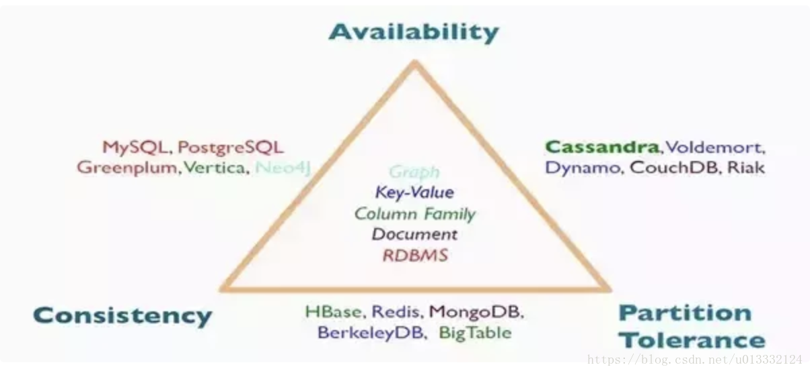

[TOC]

# 1. CAP 原理介绍

先简单介绍一下CAP原理是什么:

## C：Consistency

即一致性，访问所有的节点得到的数据应该是一样的。注意，这里的一致性指的是强一致性，也就是数据更新完，访问任何节点看到的数据完全一致，要和弱一致性，最终一致性区分开来。

## A：Availability

即可用性，所有的节点都保持高可用性。注意，这里的高可用还包括不能出现延迟，比如如果节点B由于等待数据同步而阻塞请求，那么节点B就不满足高可用性。

也就是说，任何没有发生故障的服务必须在有限的时间内返回合理的结果集。

## P：Partiton tolerance

即分区容忍性，这里的分区是指网络意义上的分区。由于网络是不可靠的，所有节点之间很可能出现无法通讯的情况，在节点不能通信时，要保证系统可以继续正常服务。

> 以实际效果而言，分区相当于对通信的时限要求。系统如果不能在时限内达成数据一致性，就意味着发生了分区的情况，必须就当前操作在C和A之间做出选择

## 关于 P

p，即Partition tolerance，很多翻译都说是分区容错性，在我理解了一些之后，我觉得这个翻译是有问题的，翻译成分区容忍更好。什么意思，就是容忍系统有网络分区，处于不同网络的子系统之间可能因为网络不可达或者其他原因造成的系统被分为多个网络区。p 对我来说最难理解，不过当翻译变过来之后，就感觉很容易理解了。

一般来说，在分布式系统中，p几乎是必然存在的，为什么？因为网络层面的问题不可避免。那么我们要如何保证分区容忍性呢？

1. 当你一个数据项只在一个节点中保存，那么分区出现后，和这个节点不连通的部分就访问不到这个数据了。这时分区就是无法容忍的。
2. 提高分区容忍性的办法就是一个数据项复制到多个节点上，那么出现分区之后，这一数据项就可能分布到各个区里。容忍性就提高了。

CAP 原理说，一个**数据分布式系统**不可能同时满足 C 和 A 和 P 这3个条件。所以系统架构师在设计系统时，不要将精力浪费在如何设计能满足三者的完美分布式系统，而是应该进行取舍。由于网络的不可靠性质，大多数开源的分布式系统都会实现P，也就是分区容忍性，之后在C和A中做抉择。

保证了分区容忍性，就带来了另一个问题，数据的一致性。为了保证数据一致性，数据同步的时间就越长，可用性就会降低。

## 对 CAP 原理的一些常见的理解误区

看到网上很多文章说CAP原理是分布式系统的基石，但是CAP原理其实是对分布式数据存储系统的一个定论。我们假设一个分布式系统各个节点都读写同一个mysql实例，那么对于这个分布式系统来说，讨论CAP原理是没有意义的。因为各个节点之间可以不用因为数据复制而进行通信，满足分区容忍性（P），可以随时响应请求，满足可用性（A），同时因为访问的是一个数据库实例，本身已经保证了数据一致性（C）。

因此，在讨论CAP原理的时候，更多的是针对那些有数据存储、数据复制场景的分布式存储系统，也就是我们熟悉的NoSql数据库。

由于我们大多数人都不会去设计一款新的NoSql数据库来使用，更多的是使用现成的NoSql开源系统进行数据的存储，比如Hbase、MongoDB、Cassandra等。所以大多数时候，其实我们都用不上CAP原理。

虽然用不上，但是了解一下还是没有坏处的。下面简单证明一下CAP

# 2. CAP 原理简单证明

假设有节点data1和节点data2，一开始有个数据**number=1**。之后向data1提交更新，将数据number设置为2。

接着data1就需要将更新推送给data2，让data2也更新number数据。

**接下来我们分3个场景分析**：

## 2.1 在保证 C 和 P 的情况下

为了保证数据一致性，data1需要将数据复制给data2，即data1和data2需要进行通信。但是由于网络是不可靠的，我们系统有保证了分区容忍性，也就是说这个系统是可以容忍网络的不可靠的。这时候data2就不一定能及时的收到data1的数据复制消息，当有请求向data2访问number数据时，为了保证数据的一致性，data2只能阻塞等待数据真正同步完成后再返回，这时候就没办法保证高可用性了。

所以，在保证C和P的情况下，是无法同时保证A的。

## 2.2 在保证 A 和 P 的情况下

为了保证高可用性，data1和data2都有在有限时间内返回。同样由于网络的不可靠，在有限时间内，data2有可能还没收到data1发来的数据更新消息，这时候返回给客户端的可能是旧的数据，和访问data1的数据是不一致的，也就是违法了C。

也就是说，在保证A和P的情况下，是无法同时保证C的。

## 2.3 在保证 A 和 C 的情况下

如果要保证高可用和一致性，只有在网络情况良好且可靠的情况下才能实现。这样data1才能立即将更新消息发送给data2。但是我们都知道网络是不可靠的，是会存在丢包的情况的。所以要满足即时可靠更新，只有将data1和data2放到一个区内才可以，也就丧失了P这个保证。其实这时候整个系统也不能算是一个分布式系统了。

> 理解CAP理论的最简单方式是想象两个节点分处分区两侧。允许至少一个节点更新状态会导致数据不一致，即丧失了C性质。如果为了保证数据一致性，将分区一侧的节点设置为不可用，那么又丧失了A性质。除非两个节点可以互相通信，才能既保证C又保证A，这又会导致丧失P性质。

# 3. CAP 原理在各个系统的应用

# 4. 总结

关于CAP原理，还需要特别注意的一点是，虽然说我们设计系统时不能同时保证拥有三点。但是也并不是说，保证了其中2点后，就要完全抛弃另外一点。只是相对的要做一些牺牲。比如在保证CP的情况下，虽然没办法保证高可用性，但这不意味着可用性为0，我们可以通过合理的设计尽量的提高可用性，让可用性尽可能的接近100%。同理，在AP的情况下，也可以尽量的保证数据的一致性，或者实现弱一致性，即最终一致性。
