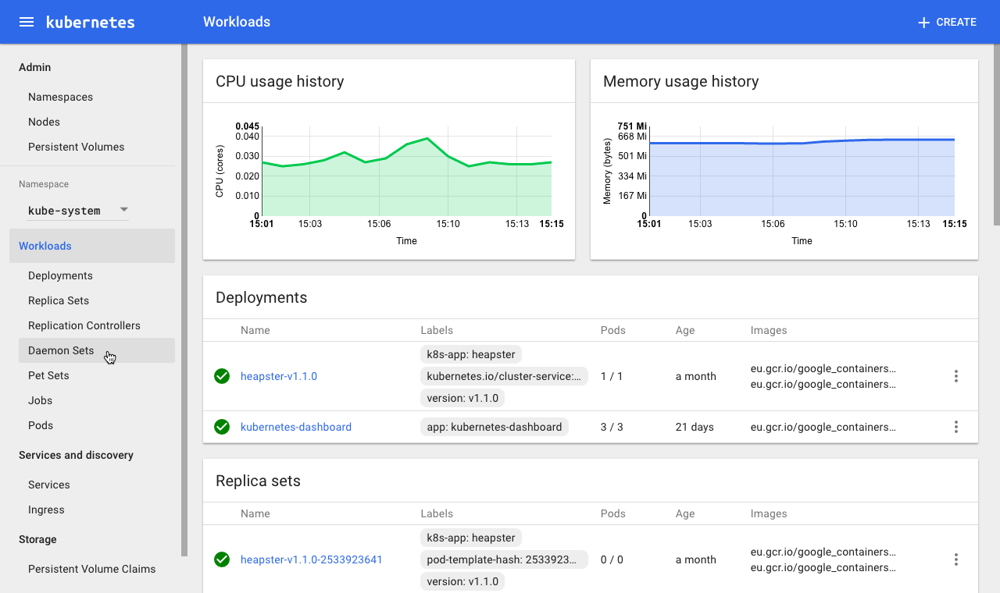
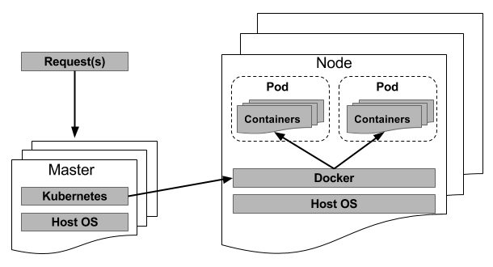

【编者的话】这是关于Linux容器介绍的第三篇，在这篇文章中，作者向我们介绍如何用Kubernetes进行容器编排。

> 了解如何使用Kubernetes创建，部署和管理数千个容器镜像。

如果您已经阅读了这个系列的前两篇文章，你现在应该已经熟悉"Linux的控制组"以及"Linux容器和Docker"了。这里简短的概括一下之前的内容：曾经，数据中心的管理员需要部署整个操作系统，占用所有硬件服务器，每个服务器都托管一些应用程序，产生了很多管理上的开销。之后技术发展到可以跨多个服务器主机进行扩展，并且整个系统越来越难以维护。这变成一个棘手的问题。随着技术继续发展，我们得以缩小整个操作系统并将这些不同的应用程序作为多个容器上的微服务启动，并托管于同一物理机器上。

在这个系列的最后一部分，我将探讨大多数人用来创建，部署和管理容器的方法。这个概念通常被称为容器编排。如果我只专注于Docker，它本身就非常简单易用，即便同时运行几个镜像也同样容易。现在，将其扩展到上百个（甚至上千个）镜像。如何管理它们？最终，您需要选择一个框架来管理它们。例如Kubernetes。

### Kubernetes

Kubernetes，或者k8s（k + 8个字母），最早来自于Google，是一个旨在自动化操作容器的开源平台：“支持应用程序容器在多个主机的集群上部署，扩展以及其他操作”。Google是Linux容器的早期使用者及贡献者，（实际上，Linux容器为谷歌自己的云服务提供了支持）Kubernetes消除了容器化应用在部署和扩展过程中涉及到的手动步骤，它能够将托管Linux容器的服务器组聚集在一起，同时还允许管理员轻松高效地管理这些集群。

Kubernetes可以让您及时部署应用程序，轻松扩展相同的应用程序并无缝地推出新功能，同时限制硬件资源的消耗，这些功能可以让您的应用程序快速响应消费者需求。它非常模块化，可以轻松地接入其他应用程序或框架。它还提供额外的功能，例如自我修复服务，包括自动放置（auto-placement），自动复制（auto-replication）和容器的自动重启（auto-restart）。

Docker也有自己的平台叫做Swarm。它实现了许多类似于Kubernetes的任务，并拥有许多相同的功能。两者之间的主要区别在于Swarm围绕于Docker，而Kubernetes则倾向于采用更通用的容器支持模型。

有时，生产中的应用程序会跨越多个容器，并且这些容器可能部署时跨多个物理服务器。 Kubernetes和Swarm都为您提供了部署和扩展这些容器所需的编排和管理功能，以适应不断变化的工作负载要求。

### 架构

Kubernetes运行于操作系统之上（例如Ubuntu Server，Red Hat Enterprise Linux，SUSE Linux Enterprise Server等），并采用主从（master-slave）方法来实现其功能。*主节点*（master）表示控制Kubernetes节点的机器（物理或虚拟）。这是所有任务的起源。它是集群的主要控制单元，将接受管理员或DevOps团队发出的命令，然后将它们转发到底层节点。主节点（master）可以配置成在单个机器上运行，在高可用性集群中主节点也可以配置成在多个机器上运行。这是为了确保集群的容错能力并降低停机的可能性。节点就是执行主服务器分配的任务的机器。节点有时被称为Worker或Minion。

*图1. Kubernetes Web界面控制面板（来源：[kubernetes.io](https://kubernetes.io/)）*

Kubernetes可以被分解为一组组件，其中一些组件用来管理单个节点，而其余组件则是控制平面的一部分。

控制平面管理：

- etcd：是一个轻量级的分布式集群管理器。它持久并可靠的存储集群的配置，在任意时间点都能提供集群的正确信息。
- API服务器：通过HTTP和JSON提供Kubernetes API服务。它为Kubernetes提供了内部和外部接口。这个服务器处理和验证RESTful请求，并提供多个工具和库之间的通信。
- 调度程序：选择应在哪个节点上运行未调度的Pod。调度逻辑基于资源可用性。调度程序会记录每个节点的资源利用率，确保分配的工作负载不会超过物理机或虚拟机上可用的资源。
- 控制管理中心：托管DaemonSet和复制控制器（Replication controllers）的进程，控制器通过API服务器来创建，更新以及删除受管理的资源。

节点管理：

- kubelet：负责每个节点的运行状态，并确保节点上的所有容器都是健康的。控制平面中管理器会指示kubelet处理容器内应用程序容器的启动和停止（请参阅下一节中与Docker的不同之处）。
- kube-proxy：网络代理以及负载均衡器，负责将流量引导到合适的容器。
- cAdvisor：监视和收集每个节点上每个容器的系统资源利用率和性能指标（例如CPU，内存，文件和网络）的代理。

### 控制器

控制器通过管理一组Pod来驱动集群的状态。 复制（Replication）控制器通过在整个节点集群上运行一定数量的指定Pod的副本来实现Pod复制和扩展。它还可以在节点出现故障时创建替换的Pod。 DaemonSet控制器负责每个节点只运行一个Pod。作业控制器通过运行Pod来完成任务（即作为批处理作业的一部分）。

### 服务

在Kubernetes术语中，服务由一组协同工作的Pod组成（一层或多层应用程序）。由于Kubernetes提供服务发现和请求路由（通过分配适当的静态网络参数），它确保所有服务请求都到达正确的Pod，无论请求在集群中的哪个位置移动。这些移动中有一些可能是由于Pod或节点故障。不过，Kubernetes的自我修复功能将使这些不健康的服务自动恢复到原始状态。

### POD

当Kubernetes master通过创建Pod来实现将一个或多个容器的组部署到单个节点。 Pod从容器中抽象出网络和存储，并且Pod中的所有容器将共享相同的IP地址，主机名等，允许它在集群中移动而不会出现复杂情况。

kubelet将会监控每个Pod。如果某个Pod处于不良状态，kubelet会将这个Pod重新部署到同一节点。除此之外，节点的状态会通过一种心跳消息机制每隔几秒就传输到master。一旦master检测到节点故障，复制控制器就会立即将受影响的Pod启动到另一个健康的节点上去。

那么，Docker是如何适配这一切的呢？ Docker仍然像之前一样运作。当Kubernetes主节点（master）将Pod安排到节点时，在该节点上运行的kubelet将指示Docker启动所需的容器。 kubelet将继续监控这些容器，同时还为主节点（master）收集信息。 Docker仍将完全控制在节点上运行的所有容器，并且还将负责启动和停止它们。唯一的区别是你现在有一个自动化的系统将这些请求发送到Docker而不是系统管理员手动运行相同的任务。

*图2. Pod的创建/管理通用模型*

### 云原生计算

云原生计算（通常称为Serverless计算）不仅是数据中心最新的热门流行词，而且还提供了一种托管应用程序的新方式。这个想法挑战了传统上已经成为常态的东西，并将更多的精力投入到应用程序本身，同时将应用的底层抽象出去。但是在深入了解Serverless计算的细节之前，先快速了解一下云计算。

#### Serverless化（无服务器化）

云原生计算是一个相对较新的术语，它描述了一种更现代的部署和管理应用程序的趋势。这个想法很简单。每个应用程序或进程都被打包到各自的容器中，而容器又可以在多节点集群内进行动态编排（即调度和管理）。这种方法将应用程序从对物理硬件和操作系统的依赖脱离出来而转移到它们自己的独立的沙盒环境中，这些环境可以透明地无缝地在数据中心内的任何位置运行。云原生方法是分离应用程序交付的各个组件。

#### 云中容器的演变

容器技术使大家更快的采用了云服务，试想一下，您可以在几秒钟内根据需求启动或者关闭这些持久的容器化应用镜像，并在多个节点或数据中心进行平衡，以实现最佳的服务质量（quality of service，QoS）。即便大型公共云提供商也使用容器技术，都基于同一个原因：快速部署应用程序。例如：亚马逊，微软和谷歌利用Docker提供他们的容器服务。而且，由于它需要适用于更大的Serverless生态系统，托管在这些容器中的应用程序是无状态以及事件触发的。这意味着第三方组件需要管理对此应用程序的访问，因为它是需要被调用的。

现在，当我想到一个真正的Serverless解决方案时，首先想到的就算是亚马逊AWS Lambda，它通过容器来托管您所需的应用程序，保证您的业务和服务的访问和可用性，它使Serverless上升到新的台阶。在这个模型下，您无需配置或管理物理或虚拟服务器。假设它处于稳定或生产状态，您只需部署代码，就可以了。使用Lambda，您无需管理容器（这样进一步减少了开销）。您的代码只是部署在隔离的容器化环境中。AWS Lambda允许用户通过自定义的HTTPS请求直接触发用户定义的代码功能，特别简单易用。 Lambda与传统的容器化部署的不同之处在于，亚马逊为开发人员提供了一个框架，用于上传他们的事件驱动的应用程序代码（用Node.js，Python，Java或C＃编写），并在几毫秒内响应事件，例如网站点击。您的代码运行所需要的全部库和依赖项容器都会提供。 Lambda会自动扩展以满足您的应用程序的确切需求。

亚马逊已经实现了触发您的应用或者代码处理程序的事件类型（标记为事件源），您可以在别人访问网站或者点击的时候，发送一个REST HTTP请求，这个请求可以发送到它的API网关，或者这个网关可能是一个正在读取您IoT设备的传感器，或者也可能是上传一张照片到S3 bucket（亚马逊存储提供的云存储）。这个API网关构成了连接AWS Lambda所有部分的桥，例如，一个开发人员可以编写HTTPS请求事件的触发处理程序。

假设您需要控制代码的粒度。 Lambda可以做到，它允许开发人员编写模块化处理程序。例如，您可以编写一个处理程序来处理每个API方法的触发，并且每个处理程序都可以单独调用，更新和修改。

Lambda允许开发人员将function所有必需的依赖项（即库，原生二进制文件甚至外部Web服务）一起放到一个软件包中，从而使处理程序可以根据需要自由地访问这些依赖项。

那么，AWS Lambda与亚马逊AWS的弹性云计算（Elastic Cloud Computing， EC2）相比呢？嗯，简短的回答是Lambda简化了很多细节,通过Lambda，您在配置或维护操作环境时是没有任何开销的。如果您需要能访问完整的操作系统或容器的环境，您可以启动EC2虚拟实例。EC2为用户提供了更高的灵活性，您可以使用它来定制虚拟机，虚拟机托管的硬件和软件都可以被定制。如果您只需要托管一个功能或单一功能的应用程序，那么选择Lambda更合适。Lambda没有太多可定制的——但有时候，越简单反而越好。

#### 云原生计算基金会

成立于2015年，云原生计算组织（Cloud Native Computing Foundation，CNCF）旨在标准化托管云服务的最新范例转变——即统一和定义云原生时代。虽然该基金会的主要目标是成为云原生软件项目的最佳托管场所。该基金会同时也是许多以云为中心的项目的基地，包括Kubernetes这种编排框架。

为了帮助标准化这一新的计算趋势，该基金会将整个架构划分为一组子系统，每个子系统都有自己的一套标准化API用于组件间通信。子系统包括编排，资源调度和分布式系统服务。

您可以访问基金会的[官方网站](https://www.cncf.io./)了解有关该基金会的更多信息。

### 概览

Kubernetes将容器管理扩展到容器传统管理范围之外，允许您以一种有效和高效地方式来扩展容器以满足消费者需求。对于现代和主要的Linux发行版，部署Kubernetes集群十分简单，只需要运行脚本以及回答几个问题。

当你进一步探索Kubernetes时，有些公司提供以Kubernetes为中心的服务和解决方案。其中一家公司是Heptio，由Kubernetes联合创始人Craig McLuckie和Joe Beda创立。 Heptio的产品和服务以开发人员和系统管理员为中心，简化并扩展了Kubernetes生态系统。

在同一生态系统中我们同时也需要维护容器镜像的安全性和合规性。当您将容器扩展到数千个时，管理它们几乎是不可能的。而像Twistlock这样的公司就是为您解决这类问题的。Twistlock开发和销售同名产品，专注于Docker镜像的安全性和合规性。它也可以由编排平台（包括Kubernetes）进行操作和管理。

**原文链接：[Everything You Need to Know about Containers, Part III: Orchestration with Kubernetes](https://www.linuxjournal.com/content/everything-you-need-know-about-containers-part-iii-orchestration-kubernetes)**

