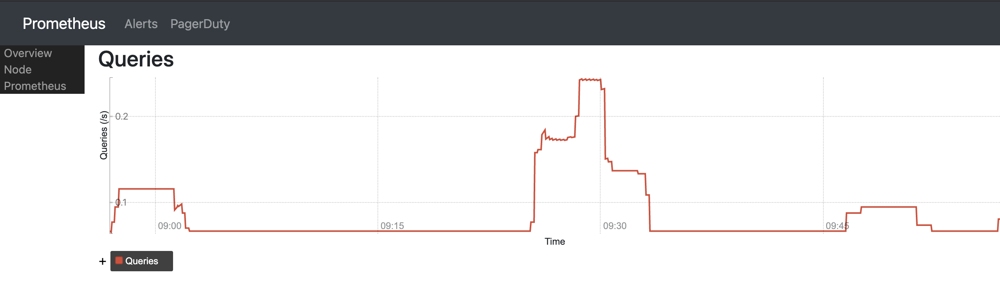

Prometheus内置了一个简单的解决方案`Console Template`,它允许用户通过Go模板语言创建任意的控制台界面，并且通过Prometheus Server对外提供访问路径。

# 1. 快速开始

首先我们先从一个小例子开始，创建我们的第一个Console Template页面。

与Console Template有关的两个启动参数为:

- `--web.console.libraries`：指定页面组件（库）的存储路径
- `web.console.templates`：指定页面模版的存储路径

默认情况下其分别指向Prometheus当前安装路径的`console_libraries`和`consoles`目录。

Prometheusn在`console_libraries`目录中已经内置了一些基本的界面组件，用户可以直接使用。

在`consoles`目录下创建index.html文件后，刷新Prometheus界面可以看到在顶部菜单中多了一个Consoles菜单项，如下所示。该选项默认指向`consoles/index.html`文件：


# 2. 定义页面菜单

首先，我们先直接使用console_libraries中定义的`head`组件，并加入到index.html文件中：

```
{{template "head" .}}
```

此时，如果我们刷新浏览器可以看到以下内容：


查看`head`组件的定义，可通过关键字`define "head"`在`console_libraries`目录中查找。默认定义在`prom.lib`文件中：

```
{{ define "head" }}
<html>
<head>
{{ template "prom_console_head" }}
</head>
<body>
{{ template "navbar" . }}
{{ end }}
```

如果希望Console Template页面的导航菜单与Prometheus UI一致，只需要修改`navbar`组件的定义即可，将`menu.lib`文件中的`navbar`定义修改如下：

```
{{ define "navbar" }}
<nav class="navbar navbar-inverse navbar-static-top">
  <div class="container-fluid">
    <!-- Brand and toggle get grouped for better mobile display -->
    <div class="navbar-header">
      <button type="button" class="navbar-toggle collapsed" data-toggle="collapse" data-target="#bs-example-navbar-collapse-1">
        <span class="sr-only">Toggle navigation</span>
        <span class="icon-bar"></span>
        <span class="icon-bar"></span>
        <span class="icon-bar"></span>
      </button>
      <a class="navbar-brand" href="{{ pathPrefix }}/">Prometheus</a>
    </div>

    <div class="collapse navbar-collapse" id="bs-example-navbar-collapse-1">
      <ul class="nav navbar-nav">
        <li><a href="{{ pathPrefix }}/alerts">Alerts</a></li>
        <li><a href="{{ pathPrefix }}/graph">Graph</a></li>
      </div>
    </ul>
  </div>
</nav>
{{ end }}
```

如果不需要侧边栏菜单，可在`head`组件中移除`{{ template "menu" .}}`。

# 3. 定义图表

在Console Template中我们可以在页面中使用内置的`PromConsole.Graph()`函数，该函数通过`head`加载相应的js源码，在该函数中，通过指定特定的DOM节点以及相应的PromQL表达式，即可在特定区域图形化显示相应的图表内容，如下所示：

```
<h1>Prometheus HTTP Request Rate</h1>

<h3>Queries</h3>
<div id="queryGraph"></div>
<script>
new PromConsole.Graph({
  node: document.querySelector("#queryGraph"),
  expr: "sum(rate(prometheus_http_request_duration_seconds_count{job='prometheus'}[5m]))",
  name: "Queries",
  yAxisFormatter: PromConsole.NumberFormatter.humanizeNoSmallPrefix,
  yHoverFormatter: PromConsole.NumberFormatter.humanizeNoSmallPrefix,
  yUnits: "/s",
  yTitle: "Queries"
})
</script>
```

这里创建了一个id为queryGraph的div节点，通过在页面中使用PromConsole.Graph函数，我们可以绘制出表达式`sum(rate(prometheus_http_request_duration_seconds_count{job='prometheus'}[5m]))`的可视化图表如下所示：



除了最基本的node以及expr参数以外，`PromConsole.Graph`还支持的完整参数如下：

| 参数名称        | 作用                                                         |
| --------------- | ------------------------------------------------------------ |
| expr            | Required. Expression to graph. Can be a list.                |
| node            | Required. DOM node to render into.                           |
| duration        | Optional. Duration of the graph. Defaults to 1 hour.         |
| endTime         | Optional. Unixtime the graph ends at. Defaults to now.       |
| width           | Optional. Width of the graph, excluding titles. Defaults to auto-detection. |
| height          | Optional. Height of the graph, excluding titles and legends. Defaults to 200 pixels. |
| min             | Optional. Minimum x-axis value. Defaults to lowest data value. |
| max             | Optional. Maximum y-axis value. Defaults to highest data value. |
| renderer        | Optional. Type of graph. Options are line and area (stacked graph). Defaults to line. |
| name            | Optional. Title of plots in legend and hover detail. If passed a string, [[ label ]] will be substituted with the label value. If passed a function, it will be passed a map of labels and should return the name as a string. Can be a list. |
| xTitle          | Optional. Title of the x-axis. Defaults to Time.             |
| yUnits          | Optional. Units of the y-axis. Defaults to empty.            |
| yTitle          | Optional. Title of the y-axis. Defaults to empty.            |
| yAxisFormatter  | Optional. Number formatter for the y-axis. Defaults to PromConsole.NumberFormatter.humanize. |
| yHoverFormatter | Optional. Number formatter for the hover detail. Defaults to PromConsole.NumberFormatter.humanizeExact. |
| colorScheme     | Optional. Color scheme to be used by the plots. Can be either a list of hex color codes or one of the color scheme names supported by Rickshaw. Defaults to 'colorwheel'. |

还可以使用模板组件`prom_query_drilldown`定义一个连接直接跳转到Graph页面，并显示相应表达式的查询结果， 如下所示：

```
<h3>Links</h3>
{{ template "prom_query_drilldown" (args "prometheus_http_response_size_bytes_bucket") }}
```

我们也可以和原生Prometheus UI一样定义一个时间轴控制器，方便用户按需查询数据：

```
{{ template "prom_graph_timecontrol" . }}
```

